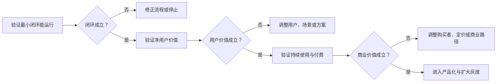
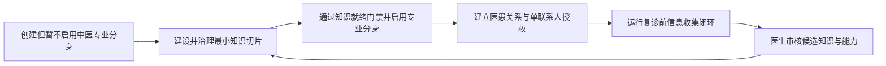
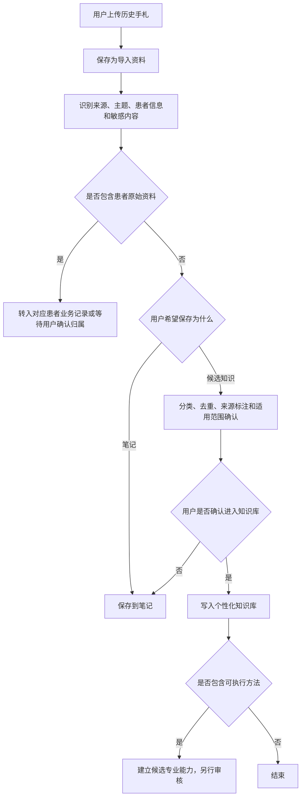
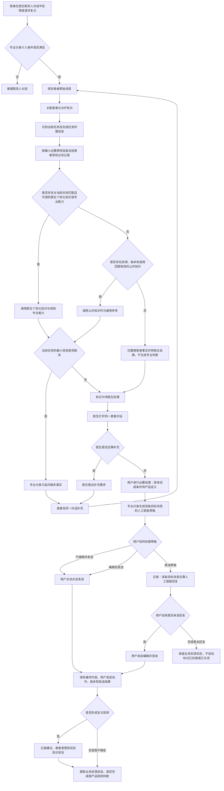
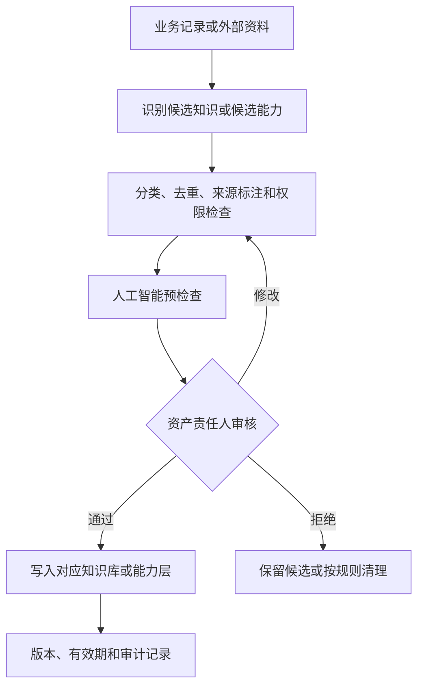

# 中医数字伴侣首要核心用户单场景解决方案

## 0. 文档信息

| 项目 | 内容 |
|---|---|
| 文档目的 | 从一个首要核心用户和一个高频、高价值核心场景出发，设计用于验证最小闭环、用户价值和商业价值的解决方案 |
| 首要核心用户 | 高负荷独立执业中医 |
| 核心场景 | 长期调理患者复诊前的信息收集与状态回顾 |
| 方案阶段 | 验证方案，可进入原型、人工模拟和受控灰度 |
| 事实口径 | 已确认产品决策优先；访谈信息只支持相应范围；待验证内容不得写成事实 |
| 权威基线 | [数字伴侣-产品决策基线](../baseline/数字伴侣-产品决策基线.md) |

## 1. 方案摘要

本方案不是已经确定要完整建设的产品蓝图，而是一套用于验证三个问题的最小方案：

1. 最小闭环是否能够真实运行。
2. 该闭环是否为首要核心用户产生净用户价值。
3. 用户价值是否能够转化为可持续的商业价值。

本方案不为所有中医、所有患者和所有诊疗环节设计统一系统，只验证一个首要核心用户在一个核心场景中的问题。

> [!IMPORTANT] 产品核心原则
> **主 Agent 拥有专业能力，但不读。**
>
> “拥有”指主 Agent 代表主用户持有专业能力的控制权、授权权和调度权；“不读”指主 Agent 默认不读取专业分身的专业记忆、患者服务内容和知识库正文。主 Agent 只读取专业分身是否存在、能力清单和运行状态，并通过接口完成路由。

> 当长期调理患者在服药后反馈不适、效果、症状变化或提出复诊请求时，医生专业分身在原有医生联系人对话中收集当前任务缺失的最小事实，并将原始信息写入业务记录；用户查看并进行必要处理；专业分身根据用户已经明确的内容生成回复草稿；用户无论是否编辑草稿，最终发送动作都由用户完成。用户也可以取消该条人工智能草稿，表示该条目标消息无需人工智能回复。

### 1.1 三个验证目标

| 验证目标 | 核心问题 | 成立标准 | 停止或调整信号 |
|---|---|---|---|
| 最小闭环验证 | 患者反馈、信息补充、医生处理、回复发送和状态保存能否在真实工作中连续完成 | 医生和患者能够在不依赖额外人工补流程的情况下完成至少一轮闭环；关键状态和责任清楚 | 流程频繁中断；需要大量线下补录；角色、状态或资料归属无法明确 |
| 用户价值验证 | 新流程是否比微信、纸质病历和人工记忆产生更高净价值 | 医生实际查看并使用收集的信息；重复查找或补问减少；患者可接受；阅读、核对和修改成本没有抵消收益 | 医生不查看；患者大量放弃；人工智能追问或草稿增加总任务成本 |
| 商业价值验证 | 已验证的用户价值是否足以推动持续使用和付费 | P0医生愿意持续使用，并能明确为减少私人时间、降低遗漏、提高承载量或服务连续性中的至少一种结果付费 | 只有口头兴趣；使用者没有购买权；价值不能转化为预算；现有方式已经足够 |

### 1.2 验证顺序



后一个阶段不能代替前一个阶段。闭环尚未成立时，不验证付费；用户价值尚未成立时，不以收入假设证明方案正确。

方案遵循四项基本判断：

1. 主 Agent 是医生本人的私人数字伴侣，不是诊所患者管理系统。
2. 面向患者提供受控服务的是医生专业分身，不是主 Agent。
3. 患者病历、反馈和诊疗状态首先是业务记录，不因可检索而自动成为知识。
4. 只建设完成本场景所需的最小知识切片，不先建设大而全的中医知识库。

### 1.3 知识库作为正式前置阶段

知识库不再只是专业分身运行时的可选检索来源，而是本场景进入受控灰度前必须完成的产品阶段。总体顺序固定为：



P0 的知识就绪门禁为：

1. 反馈与复诊任务分类规则已经医生或责任人确认。
2. 各类任务的最小信息规则、追问停止条件和禁止行为已确认。
3. 医生注意事项、回复规则和表达方法已明确归入个性化知识库或专业能力层。
4. 必要公共资料具备来源、版本、适用范围、审核状态和有效期。
5. 候选知识、正式知识、专业能力和患者业务记录的存储与权限边界可被审计。

未通过知识就绪门禁时，可继续使用普通联系人对话和人工处理，但不得开启专业分身的自主追问或面向患者的人工智能草稿。

---

## 2. 一个首要核心用户

### 2.1 用户定义

| 维度 | 首要核心用户特征 | 状态 |
|---|---|---|
| 执业形态 | 私立诊所或个人工作室的独立执业中医 | 当前优先假设 |
| 患者情况 | 已有稳定患者，复诊和长期调理患者较多 | 当前优先假设 |
| 工作负荷 | 接诊和诊后沟通接近个人承载上限 | 待逐人量化 |
| 沟通方式 | 已经通过微信或类似联系人对话处理诊后反馈 | P0筛选条件 |
| 当前工具 | 微信、纸质病历、个人记忆或多个分散工具 | 待逐人记录 |
| 人员支持 | 没有专职助理 | 当前优先假设 |
| 决策权 | 能够自行决定试用或购买工具 | P0筛选条件 |
| 人工智能态度 | 愿意通过真实试用验证，而不是只表达兴趣 | 行为筛选条件 |

### 2.2 不用泛化画像代替行为证据

以下内容不作为首要核心用户的决定性条件：

- 固定年龄，例如“40岁”。
- 单纯从业年限。
- “愿意拥抱人工智能”的口头表态。
- “中医很忙”的笼统描述。
- 公立、私立、线上、线下等单一职业标签。

每位种子医生必须单独记录：

- 每周发生多少次目标反馈或复诊任务。
- 长期调理患者比例。
- 当前恢复一名患者病程上下文需要哪些步骤。
- 医生在什么时点查看既往资料。
- 当前工具在哪一步失败。
- 医生是否具有购买权。
- 新流程是否降低了总任务成本。

### 2.3 用户任务

> 当长期调理患者产生新反馈或准备复诊时，医生希望不必重新翻找多个渠道和重复询问，就能获得本轮处理所需的信息，同时保留全部诊疗决策权和对外发送权。

### 2.4 中医体验视角的产品代入

> [!WARNING] 证据边界
> 以下体验路径尚未经过真实中医用户的实际使用与体验验证，仅为产品人员代入 P0 中医后的方案推演。  
> 本节不能作为“中医一定会这样使用”的研究结论，必须通过可用性测试、人工模拟和真实灰度补充证据。

#### 2.4.1 完整体验路径

| 步骤 | 中医体验视角 | 产品行为 | 当前状态 | 需要验证或补充 |
|---|---|---|---|---|
| 1. 注册并获得主 Agent | 我下载数字伴侣，完成登录注册，进入应用后拥有一个服务于我本人的主 Agent | 本期使用手机号和验证码完成登录；为用户创建或绑定主 Agent | 登录基线已确认；主 Agent创建机制待研发确认 | 医生是否理解主 Agent服务自己，而不是替自己管理患者 |
| 2. 创建专业分身 | 我希望建立一个代表自己专业服务能力的中医专业分身 | 用户选择职业大类，再选择具体职业，完成专业分身创建 | 目标方案 | 创建步骤是否过长；职业选择能否让用户正确理解分身用途 |
| 3. 选择职业 | 我先从医疗相关大类中选择自己的领域，再选择“中医” | 职业大类采用产品预设单选项：医疗、护理、制药；本期提供适量具体职业单选项，例如中医 | 产品代入方案，待验证 | 大类命名、具体职业数量和职业认证均需后续完善 |
| 4. 导入历史手札 | 我把过去保存的手札上传给专业分身，希望它能够在后续专业任务中使用 | 文件先进入导入、解析和归属确认流程，经用户确认后进入专业分身获权的个性化知识库或笔记 | 目标方案 | 必须先明确笔记与知识库边界，不能上传后自动视为正式专业知识 |
| 5. 邀请患者 | 我邀请一位已有长期调理关系的患者下载数字伴侣 | 生成邀请方式；患者完成下载、注册和登录 | 待验证 | 患者为什么愿意下载；邀请转化、隐私顾虑和安装成本 |
| 6. 建立好友关系 | 患者接受邀请后，我添加对方为好友 | 建立联系人关系 | 目标方案 | 好友建立方式、双方确认和失败处理 |
| 7. 标记为客户 | 我将该好友标记为客户，表示专业分身可以在受控条件下协助这段专业服务关系 | 在医生侧形成“客户”分组；专业分身获得介入该联系人的必要条件之一 | 产品原则已明确 | 是否需要向患者告知或取得授权；取消标记后的权限和记录处理 |
| 8. 建立长期调理上下文 | 我在与患者的既有联系人对话中持续提供服务，不需要患者寻找新的专业分身入口 | 患者始终通过医生联系人对话沟通；专业分身作为观察者按策略介入 | 已确认产品边界 | 人工智能标识的具体文案和位置 |
| 9. 触发复诊前场景 | 患者主动反馈、主动请求复诊，或者我主动询问后判断需要继续处理 | 系统识别反馈或复诊相关任务，并检查专业分身和客户授权 | 核心场景已选定 | 真实触发频率、医生主动询问方式和没有明确复诊安排时的处理 |
| 10. 收集最小信息 | 专业分身只询问这次任务缺少的信息，不让患者重复填写整套资料 | 复用获权业务记录；在同一对话中追问缺失事实；保存患者原话 | 方案已明确，字段待验证 | 每类任务的最小字段、追问上限和患者停止原因 |
| 11. 中医查看和补充 | 我打开同一患者对话，查看患者原话和补充内容；信息不足时继续追问 | 标记待用户处理；保留患者自述、来源、时间和诊疗轮次 | 目标方案 | 医生是否实际查看；“完成必要处理”的产品定义 |
| 12. 形成回复草稿 | 我完成人工判断后，专业分身基于我已经明确的内容生成草稿 | 生成未发送的人工智能草稿 | P0回复策略已确认 | 草稿是否减少表达成本，还是增加核对负担 |
| 13. 用户处理草稿 | 我可以直接发送、编辑后发送，或者取消这条草稿 | 所有正式消息由用户发送；取消只表示该条目标对话无需人工智能回复 | 已确认产品规则 | 取消后是否亲自回复属于独立行为；不能自动关闭业务反馈任务 |
| 14. 记录复诊状态 | 如果我决定建议复诊，系统记录建议、患者意愿、安排和实际到诊；如果暂不建议，也保存本轮状态 | 分开记录复诊建议、患者确认、改期、取消、未到和实际到诊 | 方案已明确，状态规则待细化 | “用户完成必要处理”和业务闭环终点仍需产品定义 |
| 15. 进入下一轮 | 患者实际复诊时，我再次问诊和把脉，并形成下一阶段方案 | 创建或关联下一诊疗轮次，保留上一轮记录 | 业务流程输入支持 | 具体诊疗手段不在本方案范围内 |

#### 2.4.2 专业分身创建中的职业选择

本期建议采用两级单选：

```text
职业大类：医疗／护理／制药
→ 具体职业：中医／其他本期开放职业
```

产品约束：

- 本期只提供适量职业选项，不追求完整职业目录。
- 职业选项用于专业分身的能力初始化和产品体验，不等同于执业资质认证。
- 在认证体系完善前，不根据用户自选职业开放高风险自动化能力。
- 后期需要补充会员等级对应的专业分身数量、知识容量、调用额度、协作权限和认证权益；本期不因会员差异过度限制核心闭环验证。

#### 2.4.3 手札导入时必须细化“知识库”和“笔记”

> [!IMPORTANT] 产品待定义
> “上传手札”不等于“写入正式知识库”。产品必须先判断用户是在保存材料，还是在确认一条可长期调用的专业知识。

| 维度 | 笔记 | 知识库 |
|---|---|---|
| 主要目的 | 保存用户记录、灵感、原始摘录和待整理材料 | 保存经过治理、可检索、可引用和可长期调用的知识资产 |
| 内容状态 | 可以不完整、存在个人缩写或尚未确认 | 必须有来源、分类、确认状态、适用范围和版本 |
| 人工智能使用 | 默认只在用户指定时读取或作为候选资料 | 在获权场景中可被专业分身检索和引用 |
| 写入方式 | 用户直接保存 | 导入、解析、分类、去重、来源标注、用户确认后写入 |
| 风险 | 内容可能含患者隐私、错误判断或未完成想法 | 错误内容会被反复调用，风险更高 |
| 与能力关系 | 可能成为候选知识或候选能力的来源 | 提供“知道什么”；不能自动变成“如何做”的能力 |

手札上传建议流程：



#### 2.4.4 客户标记的产品心智

“客户”首先是医生对联系人进行分组的产品心智，不等于患者的公开身份标签。

| 原则 | 说明 |
|---|---|
| 医生侧分组 | 帮助医生区分普通好友和存在专业服务关系的联系人 |
| 专业分身门禁 | 只有标记为客户后，专业分身才可能按策略介入 |
| 患者侧感知 | 患者仍然看到医生联系人，不形成独立专业分身联系人 |
| 权限不自动扩大 | 客户标记不等于授权读取全部患者资料 |
| 可撤销 | 取消客户标记后停止新的专业分身介入，历史记录按数据规则处理 |
| 合规待确认 | 是否需要患者告知、确认或单独授权，属于发布前阻断问题 |

#### 2.4.5 体验验证埋点

| 阶段 | 建议事件 | 验证目的 |
|---|---|---|
| 注册 | 注册开始、验证码成功、注册完成、主 Agent首次展示 | 判断医生是否完成基础激活 |
| 创建专业分身 | 创建开始、大类选择、职业选择、创建完成、创建放弃 | 判断创建流程和职业选项是否清晰 |
| 手札导入 | 上传开始、解析成功、识别敏感内容、选择笔记、选择候选知识、确认入库、放弃导入 | 验证用户是否理解笔记与知识库差异 |
| 邀请患者 | 邀请生成、邀请打开、患者注册、好友关系建立 | 验证患者侧采用成本 |
| 客户分组 | 标记客户、取消标记、授权确认 | 验证分组心智和权限理解 |
| 场景触发 | 患者反馈、患者请求复诊、医生主动询问、已有安排到期 | 验证真实触发分布 |
| 信息收集 | 专业分身追问、患者补充、患者拒绝或超时 | 验证最小信息完成和放弃原因 |
| 用户处理 | 用户打开目标对话、要求补充、人工智能草稿生成 | 验证医生是否进入真实工作流 |
| 草稿操作 | 未编辑发送、编辑后发送、取消草稿、取消后亲自回复 | 验证草稿价值，避免把取消等同于业务完成 |
| 复诊状态 | 建议复诊、患者确认、改期、取消、未到、实际到诊 | 验证复诊意愿与真实行为 |

---

## 3. 一个高频、高价值核心场景

### 3.1 场景定义

**长期调理患者复诊前的信息收集与状态回顾。**

该场景已经被选定为当前产品的首要核心场景，不再与初诊、获客、内容创作、完整线上诊疗或诊所经营管理同时竞争首版范围。

“高频、高价值”是产品当前选择，实际频率、任务成本和付费价值仍需在首要核心用户中逐人验证。

### 3.2 场景触发

| 触发类型 | 示例 | 是否需要已有复诊安排 |
|---|---|---:|
| 患者主动反馈 | 服药后不舒服、没有效果、症状加重或出现新情况 | 否 |
| 患者主动请求复诊 | 希望提前复诊或重新复诊 | 否 |
| 已有安排到期 | 到达医生已经给出的复诊时间或条件 | 是 |
| 医生主动询问 | 医生希望了解患者服药执行和状态变化 | 否 |

医生不一定在每轮问诊结束时给出明确复诊意见。因此，产品必须同时支持“已有复诊安排”和“没有明确复诊安排”两条路径。

### 3.3 场景起点与终点

| 边界 | 定义 |
|---|---|
| 起点 | 长期调理患者产生服药反馈、症状变化、复诊请求，或已有复诊安排到期 |
| 人工智能草稿子流程终点 | 用户发送人工智能草稿或其编辑版本，或者用户取消该条人工智能草稿；系统保存操作结果 |
| 业务反馈闭环终点 | “用户完成必要处理”的具体定义尚待产品确认，当前不得仅用发送或取消人工智能草稿代替业务处理完成 |
| 下一轮起点 | 患者实际进入下一次复诊时，重新获取当前信息并关联上一诊疗轮次 |

患者确认复诊不等于实际到诊；患者曾拒绝、取消或未到，也不妨碍以后重新发起复诊。

### 3.4 “用户完成必要处理”待产品定义

“用户完成必要处理”目前只是业务占位概念，不能直接作为功能状态或验收标准。产品需要进一步明确：

| 待定义项 | 需要回答的问题 |
|---|---|
| 处理起点 | 用户打开目标消息、开始查看资料，还是执行第一次操作时进入处理中 |
| 最小处理动作 | 查看、补问、作出医疗决定、生成草稿、发送回复或其他动作中，哪些是必要条件 |
| 无需回复情形 | 哪些反馈可以不回复；由用户主动判断还是由系统规则辅助 |
| 业务完成条件 | 发送回复、建立复诊安排、确认仅记录或完成其他动作，分别如何结束业务任务 |
| 取消草稿的影响 | 只结束该条消息的人工智能回复任务，不自动完成业务反馈任务 |
| 后续人工回复 | 用户取消草稿后亲自回复时，如何关联原目标消息并更新业务状态 |
| 未回复状态 | 用户取消草稿且暂未亲自回复时，目标消息处于什么业务状态，是否需要后续提醒 |

在上述规则确认前，系统必须分别记录：

- 业务反馈处理状态。
- 人工智能草稿处理状态。
- 用户最终发送状态。

三者不得合并为一个“已处理”状态。

### 3.5 不属于本场景

- 人工智能诊断、辨证或开方。
- 完整诊所患者管理。
- 机构排班、收费、药品库存和绩效管理。
- 获客、平台流量和个人品牌运营。
- 用人工智能摘要替代患者原始信息。
- 跨患者自动发现医学规律。

---

## 4. 产品角色与硬边界

### 4.1 角色分工

| 角色 | 服务对象 | 本场景职责 | 不承担 |
|---|---|---|---|
| 用户（医生） | 患者及医生本人 | 查看信息、判断信息是否足够、完成诊疗决策；发送、编辑后发送或取消人工智能草稿；必要时亲自回复 | 不把医疗判断或最终发送权交给人工智能 |
| 患者 | 本人 | 在医生联系人对话中提供事实、反馈变化、确认个人选择 | 不负责判断病因或医学风险 |
| 主 Agent | 医生本人 | 管理个人日程和事务；持有专业分身控制权；按能力清单完成路由；呈现任务状态；提供经授权的个人复诊率、服务量或收入分析 | 不面向患者服务；不成为诊所患者管理系统；默认不读取专业内容 |
| 医生专业分身 | 医生授权的患者服务场景 | 在原医生联系人对话中识别任务、收集最小事实、读取本任务获权资料、生成未发送草稿 | 不作最终医疗决策；不自动发送 |
| 业务记录系统 | 医生与患者 | 保存患者、诊疗轮次、原始反馈、治疗方案、复诊状态和版本 | 不自动将记录转成知识或能力 |

当前场景不存在真人助理角色。

### 4.2 主 Agent 与专业能力硬隔离

> **主 Agent 拥有专业能力，但不读。**  
> 主 Agent = Owner + Router；专业分身 = Owner + Content。

| 信息 | 主 Agent 是否知道 | 规则 |
|---|---:|---|
| 专业分身是否存在 | 是 | 用于管理和路由 |
| 专业分身能力清单 | 是 | 只包含接口、适用任务和风险元信息 |
| 专业分身运行状态 | 是 | 可用、停用或异常 |
| 专业分身具体医案和经验 | 否 | 默认隔离 |
| 专业分身服务患者的具体内容 | 否 | 默认隔离 |
| 专业分身知识库正文 | 否 | 默认隔离 |

医生本人主动调阅自己的专业能力或患者任务是唯一例外：

- 医生主动发起。
- 授权对象、用途、范围和有效期明确。
- 读取可撤销、可审计。
- 读取结果不得成为主 Agent 的常驻知识或长期记忆。

### 4.3 专业分身介入前置条件

以下条件必须同时满足：

1. 医生已经创建并启用专业分身。
2. 医生已将该联系人标记为客户。
3. 当前对话是该医生与患者的联系人对话。
4. 当前消息属于本场景支持的任务。
5. 当前专业分身回复策略为“人工智能草稿回复”。

条件不满足时按普通联系人对话处理。

### 4.4 患者侧身份

- 患者看到的联系人和发送者主体是医生本人。
- 专业分身不形成独立联系人或独立入口。
- 人工智能生成内容必须按获批方案显示标识。
- 标识的具体位置和文案仍是发布阻断项。
- 自动回复在标识方案和行业风险评审通过前不得开放。

---

## 5. 最小场景闭环



### 5.1 专业分身实际介入后的内容调用判断

专业分身满足介入条件后，不能直接“搜索全部知识库并回答”。本场景沿用产品通用范式：

```text
鉴权
→ 关系与客户标记校验
→ 风险判断
→ 任务意图与回复策略识别
→ 确定完成任务所需的信息
→ 选择获权内容范围
→ 追问缺失事实或生成草稿
→ 用户确认并主动发送
→ 写入状态与审计记录
```

其中，“选择获权内容范围”按照以下顺序执行：

| 顺序 | 调用内容 | 作用 | 归属边界 |
|---:|---|---|---|
| 1 | 当前对话、患者反馈、治疗史、当前及历史诊疗轮次 | 确认正在处理谁、发生了什么、缺少什么 | 业务记录或协作容器中的获权业务记录，不是知识库 |
| 2 | 与当前任务匹配的医生个人知识 | 提供医生已经确认、可复用的专业参考 | 个性化知识库 |
| 3 | 与当前任务匹配的医生经验、追问方法和处理范式 | 决定如何收集信息、如何组织草稿 | 专业能力层；不是知识库正文 |
| 4 | 中医通用术语、规范及基础资料 | 当医生个性化内容不存在、不适用或不足时提供通用参考 | 公共知识库 |
| 5 | 无有效内容 | 只呈现患者原始事实和缺失项，交由医生处理 | 不猜测、不拼接为专业结论 |

因此，建议将原判断表述修订为：

> 专业分身先读取完成当前任务所需的患者获权业务记录，再优先调用与任务匹配、经过确认且仍然有效的医生个性化知识和专业能力。若不存在可用的个性化内容，则在权限、来源、版本和适用范围均有效的前提下调用公共知识作为通用参考；若仍无可靠内容，只整理事实并转医生处理，不生成诊断、治疗方案或复诊建议。

调用“哪一份内容”不能只按库的层级决定，还必须同时判断：

1. 是否与当前反馈或复诊任务直接相关。
2. 调用主体是否具有当前患者、当前任务和该项内容的读取权限。
3. 内容是否已经确认，而不是候选知识或未确认的人工智能推断。
4. 来源、版本、适用人群、适用条件和失效状态是否明确。
5. 与患者当前事实是否冲突；发生冲突时保留来源并交医生判断，不由人工智能自行取舍。
6. 是否只读取完成当前任务所需的最小范围。

公共知识库是通用参考和降级来源，不得覆盖医生已确认且适用于当前任务的个人内容，也不得据此自动形成医疗决策。个性化内容命中同样不代表可以自动判断病症、制定治疗方案或决定复诊。

### 5.2 主 Agent 的调度路径

当医生主动通过主 Agent 发起专业任务时：

```text
医生表达意图
→ 主 Agent 查询专业分身能力清单
→ 主 Agent 传递任务引用、对象引用和授权凭证
→ 专业分身在自己的内容域读取知识、记忆和获权业务记录
→ 专业分身返回面向医生的结果或任务状态
→ 主 Agent 向医生呈现
```

主 Agent 不复制专业知识正文，不读取专业分身内部推理，也不直接向患者发送结果。

---

## 6. 人工智能介入方案

### 6.1 三种协作模式

“问答、流程、调用”是专业分身的三种能力模式，不是三个平行角色。

| 能力模式 | 回答的问题 | 本场景行为 | 权限边界 |
|---|---|---|---|
| 问答 | 告诉我什么 | 医生主动查询患者获权记录或确认后的知识 | 不替医生得出医疗结论 |
| 流程 | 下一步做什么 | 判断任务状态、追问缺失事实、等待患者补充、转医生处理 | 不自行创建正式医疗决定 |
| 调用 | 帮我执行什么 | 读取获权记录、写入原始反馈、生成草稿、更新非医学状态 | 外部发送和医疗决定必须人工确认 |

### 6.2 各环节介入边界

| 环节 | 专业分身可以做 | 必须由医生做 |
|---|---|---|
| 任务识别 | 识别反馈、复诊请求或普通消息 | 处理无法安全识别的内容 |
| 信息收集 | 复用已有事实；追问当前任务缺失的事实 | 判断医学信息是否足够 |
| 信息呈现 | 展示患者原话、来源、时间、确认状态和关联轮次 | 判断信息是否可信、是否影响处理 |
| 诊疗 | 提供已授权资料入口 | 问诊、把脉、辨证和诊断 |
| 治疗方案 | 记录医生明确输入 | 制定、修改和确认 |
| 复诊 | 记录医生决定和患者状态 | 是否复诊、时间、方式和观察事项 |
| 回复 | 根据用户已明确内容生成未发送草稿 | 用户决定不编辑发送、编辑后发送或取消草稿；所有正式消息均由用户发送 |
| 知识沉淀 | 建立候选项并做格式、来源预检查 | 审核并决定是否采纳 |

### 6.3 当前明确不实施

- 自动诊断、辨证、开方或调整治疗方案。
- 自动决定复诊。
- 自动发送医疗回复。
- 自动判断“重大情况”及其优先级。
- 自动生成并要求医生核对完整诊疗摘要。
- 自动从患者记录学习并写入正式知识或能力。
- 跨患者自动发现医学模式。

---

## 7. 最小信息方案

### 7.1 原则

> 优先复用已有业务记录，只询问当前任务缺失的最小事实，不使用固定完整问卷。

“最小信息”只表示足以让医生理解反馈并决定下一步，不表示信息已经满足医学诊断要求。

### 7.2 任务字段

| 任务 | 优先复用 | 缺失时才询问 |
|---|---|---|
| 一般效果反馈 | 患者、上一轮方案、治疗时间 | 当前变化、开始时间、是否仍持续、是否希望医生回复 |
| 服药后不适 | 上一轮方案、用药记录 | 具体表现、出现时间、实际执行、自行停药或调整、其他用药 |
| 无效果或效果不明显 | 上一轮症状与方案 | 哪项症状无变化、执行时长、是否按方案执行、其他变化 |
| 主动要求复诊 | 上一轮记录 | 原因、较上次变化、新报告、期望线上或线下方式与时间 |

患者不愿继续提供时，停止追问，保留原始反馈并转医生处理。

---

## 8. 资料对象与归属原则

### 8.1 两套分类不能混用

“常用资料、多次迭代资料、难找资料”描述的是资料使用特征，不是知识库分级。

| 分类维度 | 回答的问题 | 示例 |
|---|---|---|
| 使用特征 | 资料如何被使用 | 常用、多次迭代、难找 |
| 内容类型 | 资料本质是什么 | 记忆、知识、能力、业务记录 |
| 共享层级 | 谁拥有和访问 | 公共、个性化、协作 |
| 确认状态 | 是否可以正式使用 | 原始、候选、待确认、已确认、已废弃 |

### 8.2 核心概念

> **知识 = 信息（knowing what），回答“知道什么”；能力 = 怎么做（knowing how），回答“如何完成”。**

| 对象 | 定义 | 中医场景示例 | 不应承担 |
|---|---|---|---|
| 记忆 | 会话上下文、近期事实和用户偏好 | 当前对话、医生回复偏好 | 正式病历或权威知识 |
| 知识 | 经过治理、确认、可检索和长期管理的信息资产 | 经典资料、确认后的经验结论、流程规则 | 未经治理的患者原始数据 |
| 能力 | 可执行的方法和工作流，包含输入、步骤、约束、输出和人工确认点 | 最小信息追问方法、医生沟通方法 | 单个患者原始病历 |
| 业务记录 | 业务中产生的原始事实、状态和正式记录 | 病历、报告、反馈、方案、复诊状态 | 自动成为知识或能力 |

### 8.3 资料归属矩阵

| 资料 | 主记录 | 是否进入记忆 | 是否直接进入知识 | 是否直接进入能力 |
|---|---|---:|---:|---:|
| 患者原始消息 | 业务记录 | 可作为当前上下文 | 否 | 否 |
| 患者基本资料、病史和过敏 | 业务记录 | 按需读取 | 否 | 否 |
| 检查报告原件 | 业务记录 | 否 | 否 | 否 |
| 每轮症状变化和执行情况 | 业务记录 | 可作为近期事实 | 否 | 否 |
| 治疗方案及版本 | 医生确认的业务记录 | 可作为本轮上下文 | 否 | 否 |
| 复诊建议与状态 | 医生确认的业务记录 | 可作为近期事实 | 否 | 否 |
| 医生确认的信息收集规则 | 规则知识 | 否 | 是 | 可配置为流程能力 |
| 脱敏并确认的案例结论 | 个性化或协作知识 | 否 | 是 | 可供能力调用 |
| 可执行的医生方法 | 专业能力 | 否 | 可引用相关知识 | 是 |
| 人工智能草稿与医生修改 | 审计业务记录 | 仅限当前任务 | 不自动进入 | 不自动学习 |

---

## 9. 中医场景三级知识库方案

### 9.1 顶层分级理念

三级知识库按照知识空间控制关系和共享关系划分。这里的“控制关系”不等同于对患者个人信息享有所有权：

| 层级 | 顶层属性 | 回答的问题 |
|---|---|---|
| 公共知识库 | 权威、共享、只读或受控更新 | 所有获权用户可以参考什么 |
| 个性化知识库 | 单个用户控制、严格隔离 | 这个用户本人的知识与经验资产是什么 |
| 协作知识库 | 共享、跨实体、有边界 | 这段协作关系或项目共同使用什么 |

“协作知识库”是产品正式名称，本质上是协作容器。容器内仍须标明每项内容属于知识、业务记录、记忆还是能力。

### 9.2 公共知识库

| 内容 | 来源要求 | P0用途 | 红线 |
|---|---|---|---|
| 中医经典及合法授权的权威注释 | 来源、版权和版本明确 | 医生主动查阅 | 不自动生成诊疗结论 |
| 中医术语、常见症状、舌脉基础知识 | 专业权威来源 | 术语解释和信息规范化参考 | 患者描述不能被自动改写为医生结论 |
| 方剂、中药材及药品说明资料 | 药典、官方说明或权威资料 | 医生参考 | 不向患者自动推荐 |
| 行业规范、执业规则和安全要求 | 正式发布来源 | 约束专业分身行为 | 过期内容必须停用或标记 |

P0只接入完成信息收集和边界控制所需的必要公共资料，不以“知识越多”为目标。

### 9.3 个性化知识库

| 内容 | 是否进入 | 条件 |
|---|---:|---|
| 医生专业笔记 | 是 | 医生主动导入或确认 |
| 医生确认后的经验结论 | 是 | 来源可追溯，适用边界明确 |
| 脱敏后的历史案例知识 | 是 | 完成授权、脱敏和医生审核 |
| 医生习惯方及使用限制参考 | 可以 | 只能供医生本人和获权专业分身参考 |
| 医生表达参考 | 可以 | 与长期偏好和能力配置边界明确 |
| 患者原始档案 | 不作为知识对象直接进入 | 保存在业务记录系统；个性化层只保存获权索引或私有命名空间 |
| 未确认的人工智能推断 | 否 | 只能作为候选，不能成为正式知识 |

医生经验的拆分规则：

- 原始诊疗过程 → 业务记录。
- 医生确认的经验结论 → 个性化知识。
- 可执行的判断、追问和表达方法 → 专业能力。

“医生拥有个性化知识库”只表示医生控制自己的知识空间，并对本人原创或依法取得的专业知识与经验享有相应权利。患者可识别档案始终属于受目的、权限、授权和生命周期约束的业务记录，不能表述为“医生拥有的知识”，也不能因只对医生可见而进入个性化知识库。

### 9.4 协作知识库

协作范围可以包括：

- 医生—患者。
- 医生—医生。
- 医生—所属机构。

P0聚焦医生—患者的当前长期调理协作。

| 协作内容 | 在容器中的内容类型 | 写入者 | 读取者 |
|---|---|---|---|
| 当前治疗方案 | 医生确认的业务记录 | 医生 | 患者、医生、获权专业分身 |
| 用药和症状反馈 | 患者自述业务记录 | 患者或家属 | 医生、获权专业分身 |
| 复诊建议、确认、改期和到诊状态 | 业务记录 | 医生、患者或系统按规则记录 | 医生、患者、获权专业分身 |
| 检查报告 | 原始业务记录 | 患者 | 医生；其他角色按专项授权 |
| 医生允许患者查看的注意事项 | 医生确认的协作信息 | 医生 | 患者 |
| 机构共同维护的流程或规范 | 协作知识 | 机构指定人员 | 获权成员 |
| 多人确认的脱敏案例 | 协作知识 | 获权医生 | 获权医生或机构成员 |

协作空间必须定义：

- 空间所有者。
- 参与者和角色。
- 每类资料的读写权限。
- 创建、变更通知、撤权和归档规则。
- 患者结束治疗后的访问和保存规则。
- 临时会诊人员的授权时限。

### 9.5 P0最小知识切片

P0不是完成三层知识库的全部建设，只需要：

| 资产 | 作用 |
|---|---|
| 当前患者与诊疗轮次索引 | 找到本轮任务的业务记录 |
| 医患协作视图 | 展示当前方案、反馈和复诊状态 |
| 医生确认的最小信息规则 | 约束专业分身追问 |
| 医生确认的注意事项和回复规则 | 支持草稿生成 |
| 反馈与复诊状态规则 | 推进流程并防止状态混淆 |
| 必要公共来源 | 支持术语、合规和边界控制 |
| 专业分身能力清单 | 供主 Agent 路由，不包含专业内容 |

---

## 10. 写入、审核和调用规则

### 10.1 知识沉淀流程



### 10.2 审核角色

| 资产 | 人工智能可以做 | 最终审核人 |
|---|---|---|
| 公共知识 | 来源、格式、重复和版本预检查 | 平台指定的专业内容治理人员或相应专家 |
| 医生个人知识 | 整理候选、提示冲突 | 医生本人 |
| 医生个人专业能力 | 生成包含输入、步骤和停止条件的能力草稿 | 医生本人 |
| 协作知识 | 权限、版本和材料完整性预检查 | 协作空间指定的医生或机构专业审核人 |
| 患者业务记录 | 来源和缺项提示 | 医生确认医学内容；患者只能确认或纠正本人提供的事实 |

主 Agent 不审核专业内容，只负责把候选项和审核任务路由给正确的人。

### 10.3 调用规则

每次调用必须同时满足：

1. 当前任务确有需要。
2. 调用主体具有权限。
3. 只读取完成任务所需的最小范围。
4. 来源、版本和确认状态可见。
5. 授权未过期且可以撤销。
6. 调用和输出可以审计。

---

## 11. P0功能范围

### 11.1 必须实现

| 功能 | 最小要求 |
|---|---|
| 专业分身管理 | 医生创建、启用和停用；主 Agent只读能力清单和状态 |
| 客户授权 | 医生标记客户后专业分身才可介入 |
| 对话内任务识别 | 识别效果、不适、症状变化和复诊请求 |
| 最小信息追问 | 复用既有记录，只补当前任务缺失事实 |
| 业务记录 | 保存原话、来源、时间、确认状态和诊疗轮次 |
| 用户处理 | 同一对话查看和补问；“必要处理”的完成条件必须由产品另行定义 |
| 草稿机制 | 专业分身生成草稿；用户可不编辑发送、编辑后发送或取消；所有正式消息均由用户发送 |
| 状态记录 | 分开记录业务反馈状态、人工智能草稿状态和用户发送状态；取消草稿不得自动标记业务已处理或关闭 |
| 复诊状态 | 区分建议、患者意愿、安排、改期、取消、未到和实际到诊 |
| 权限与审计 | 保存授权、读取、草稿、修改、发送和状态变化记录 |

### 11.2 暂不实现

- 自动医疗判断。
- 自动医疗回复。
- 完整诊疗摘要。
- 自动知识沉淀。
- 跨患者模式发现。
- 多个专业分身自动共享内容。
- 完整诊所患者管理。
- 大而全的中医知识库。

---

## 12. 产品基线、红线和约束

| 编号 | 基线、红线或准则 | 对方案的约束 |
|---|---|---|
| 1 | 数字伴侣是个人事务、专业沉淀和受控对外服务的个人能力放大器 | 不能演变成诊所管理系统 |
| 2 | 主 Agent 面向医生本人 | 不进入患者对话，不直接收集患者信息 |
| 3 | 主 Agent拥有专业能力但默认不读 | 只读专业分身存在状态、能力清单和运行状态 |
| 4 | 专业分身持有专业内容并面向患者受控服务 | 只在创建分身且联系人标记为客户后介入 |
| 5 | 患者看到的发送主体是医生 | 人工智能参与内容必须按获批方案标识 |
| 6 | P0只允许人工智能草稿回复 | 用户可不编辑发送、编辑后发送或取消草稿；所有正式消息均由用户发送，系统不得自动发送 |
| 7 | 医疗决策必须人工 | 病症、辨证、治疗方案和复诊建议均由医生决定 |
| 8 | 患者原始信息是业务记录 | 不得自动进入知识库、能力层或长期记忆 |
| 9 | 人工智能推断不能成为用户事实 | 必须采用候选、待确认、已确认状态 |
| 10 | 知识和能力严格区分 | 知识回答知道什么，能力回答如何完成 |
| 11 | 人工智能摘要尚未确认有净价值 | P0展示原始信息和必要结构，不用摘要替代 |
| 12 | “重大情况”规则没有证据 | P0不让人工智能自动判断严重程度或优先级 |
| 13 | 无代码、接口和联调证据的陈述不属于当前实现 | 本方案均为目标需求，技术对象需研发确认 |
| 14 | 敏感内容必须可授权、纠正和删除 | 不采用“患者档案不可删除”的旧口径 |

---

## 13. 用户价值与商业价值验证

### 13.1 核心判断

产品价值不能只用“节省时间”证明，也不能假设节省时间一定增加收入。

需要验证：

- 医生是否真的查看专业分身收集的信息。
- 收集的信息是否影响医生的下一步处理。
- 患者是否愿意在原对话中继续补充。
- 人工智能追问是否减少医生重复补问。
- 草稿审核是否增加核对负担。
- 新流程的总步骤和总时间是否优于微信与人工记忆。
- 价值最终表现为减少私人时间、降低认知负担、提高服务连续性还是扩大承载量。

### 13.2 建议指标

| 指标 | 定义 |
|---|---|
| 机会使用率 | 出现适用患者反馈机会时，医生实际使用该闭环的比例 |
| 有效补充率 | 患者补充的信息被医生认为对本次处理有用的比例 |
| 医生查看率 | 含补充信息的任务被医生实际打开处理的比例 |
| 人工补问次数 | 人工智能追问后医生仍需补问的次数 |
| 业务反馈闭环完成率 | 需在“用户完成必要处理”的产品定义确认后计算，不能以取消草稿代替业务完成 |
| 人工智能草稿处理率 | 已生成草稿中，被用户发送、编辑后发送或取消的比例 |
| 人工智能草稿发送率 | 已生成草稿中，最终由用户发送的比例，区分未编辑发送和编辑后发送 |
| 人工智能草稿取消率 | 已生成草稿中，被用户取消的比例；取消只代表该条目标消息无需人工智能回复 |
| 用户最终回复率 | 无论是否使用人工智能草稿，目标消息最终收到用户正式回复的比例 |
| 净处理成本 | 查找、阅读、追问、核对、修改和发送的总时间与步骤 |
| 机会持续使用率 | 观察期内再次出现适用机会时，医生继续使用的比例 |
| 患者停止原因 | 隐私顾虑、问题难懂、无即时收益、不相信医生会看或操作困难 |
| 持续使用或付费意愿 | 医生愿意为什么结果继续使用或付费 |

### 13.3 商业价值验证

商业价值不能只询问“愿不愿意付费”，应通过真实采用行为和付费动作验证。

| 验证内容 | 需要获得的证据 |
|---|---|
| 使用者与付款者是否一致 | 医生是否能够自行决定试用、续用和付款 |
| 价值对应什么付费结果 | 医生为减少私人时间、减少遗漏、提高承载量还是提升服务连续性付费 |
| 使用是否持续 | 当目标场景再次出现时，医生是否继续使用，而不是只完成首次体验 |
| 是否愿意承担切换成本 | 医生是否愿意邀请少量真实患者、整理必要资料并改变部分现有流程 |
| 是否愿意产生真实承诺 | 是否愿意延长试用、支付小额费用、签署试点确认或提供明确采购条件 |
| 价格与价值单位 | 更适合按医生、专业分身、有效闭环次数还是其他结果收费 |

商业价值成立至少需要：

1. 首要核心用户本人具有购买权，或已找到明确付款者。
2. 用户能说清楚为哪一种结果付费。
3. 在免费体验结束后仍愿意继续使用。
4. 付费意愿通过真实承诺验证，不只来自访谈表态。

商业价值不成立时，需要区分：

- 用户价值不够强。
- 使用者与付款者不是同一人。
- 节省时间不能转化为可感知收益。
- 现有方式已经足够。
- 数据、合规或迁移成本超过收益。
- 价格或收费单位不匹配价值。

---

## 14. 发布前待确认问题

| 优先级 | 待确认问题 | 默认处理 |
|---|---|---|
| P0 | 人工智能标识的文案、位置和覆盖范围 | 未确认前不开自动回复 |
| P0 | 医生标记客户时的患者告知与授权 | 进入患者灰度前完成合规评审 |
| P0 | 每类任务的最小字段和追问上限 | 由首要核心用户逐项验证 |
| P0 | 消息与诊疗轮次的自动关联规则 | 无法确定时进入待确认，不静默关联 |
| P0 | 患者不适或紧急表达的安全降级 | 人工智能不判断严重程度，交由医生查看；专业规则另行评审 |
| P0 | 主 Agent、专业分身和业务记录之间的授权接口 | 无法实现隔离时，主 Agent降级为只路由和展示状态 |
| P0 | 患者数据保留、删除、导出和撤权 | 采用可授权、可纠正、可删除原则 |
| P0 | 医患协作空间的创建、关闭和归档 | P0原型前冻结生命周期 |
| P1 | 医生本人审核知识和能力的负担 | 灰度记录审核时间、修改率和拒绝率 |
| P1 | 协作知识库是否采用独立技术对象 | 产品语义先固定，技术模型待研发确认 |

---

## 15. 与旧资料的冲突处理

| 旧描述 | 本方案处理 | 依据 |
|---|---|---|
| 主 Agent可以读取或持有全部专业内容 | 主 Agent拥有控制权但默认不读，只做所有者与路由者 | 最新产品基线 BL-022 |
| 主 Agent审核子分身专业经验 | 主 Agent只路由审核任务，医生本人或指定专业人员最终审核 | 专业能力硬隔离 |
| 患者档案直接等于个性化知识库 | 患者档案是业务记录；个性化层只提供私有命名空间或授权索引 | 四类信息边界 |
| 协作知识库里的内容全部是知识 | 协作知识库是协作容器，内部继续区分记录、知识、记忆和能力 | 顶层协作理念与知识边界 |
| 患者档案持续积累且不可删除 | 敏感内容必须可授权、纠正和删除 | 产品基线 BL-017 |
| 人工智能自动提炼患者记录并学习 | P0只建立候选项，人工审核后才能进入知识或能力 | 医疗安全和知识治理红线 |
| 主 Agent直接执行患者提醒和资料收集 | 由专业分身在获权患者对话中执行 | 主 Agent与专业分身职责边界 |

---

## 16. 当前方案结论

本方案的最小产品不是“人工智能中医”，也不是“诊所患者管理系统”，而是：

> 医生拥有和控制的数字伴侣，通过一个与专业内容硬隔离的主 Agent管理个人事务和完成能力路由，由医生专业分身在获权医患对话中收集复诊所需的最小事实、调用本任务所需资料并生成人工智能草稿；用户可以不编辑发送、编辑后发送或取消草稿，所有正式消息均由用户发送。取消草稿只结束该条目标消息的人工智能回复任务，不代表用户不会亲自回复，也不代表业务反馈已经处理完成。医生保留全部医学决策与发送权；所有患者信息先进入业务记录，只有经过授权、脱敏、分类和人工审核后，才可能进入三级知识库或专业能力层。

首版成功的判断不是知识库规模，也不是人工智能生成内容数量，而是：

1. 首要核心用户在真实高频场景中持续使用。
2. 患者能够完成最小信息补充。
3. 医生实际查看并使用这些信息。
4. 新流程的总任务成本低于现有方式。
5. 没有突破主 Agent、专业分身、医疗决策和敏感资料的产品红线。

---

## 17. 参考文件

- [数字伴侣-产品决策基线](../baseline/数字伴侣-产品决策基线.md)
- [中医用户画像与ICP-问题诊断及验证计划](../research/中医用户画像与ICP-问题诊断及验证计划.md)
- [中医复诊前信息收集与状态回顾-用户场景](../research/中医复诊前信息收集与状态回顾-用户场景.md)
- [中医患者诊疗与复诊-完整流程](../research/中医患者诊疗与复诊-完整流程.md)
- [中医数字伴侣-最小闭环泳道与数据流](../research/中医数字伴侣-最小闭环泳道与数据流.md)
- [中医数字伴侣-知识库与AI工作流审查报告](../research/中医数字伴侣-知识库与AI工作流审查报告.md)
- [中医核心场景-记忆与三级知识库映射规范](../research/中医核心场景-记忆与三级知识库映射规范.md)
- [长期调理复诊核心场景-待确认问题](../research/长期调理复诊核心场景-待确认问题.md)
- [中医数字伴侣长期调理复诊最小闭环产品需求文档](../prd/中医数字伴侣长期调理复诊最小闭环产品需求文档.md)
