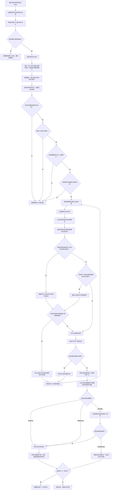
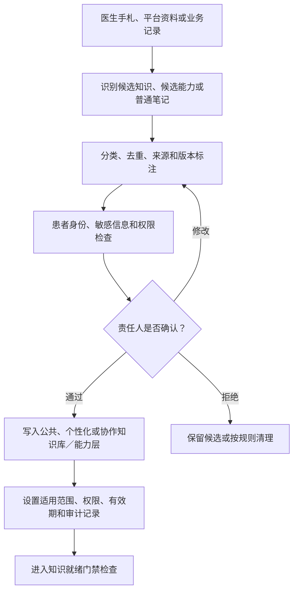
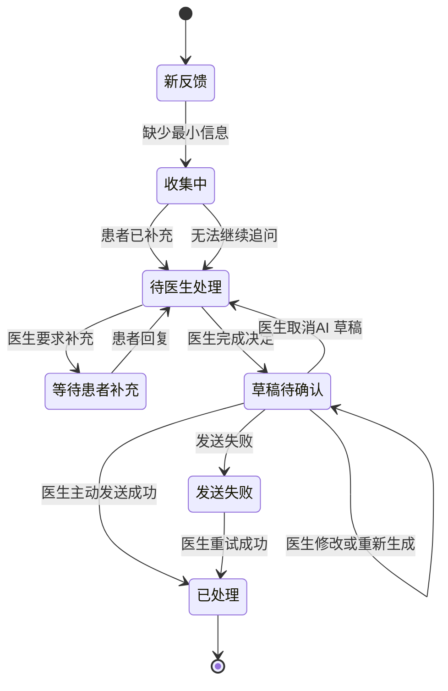
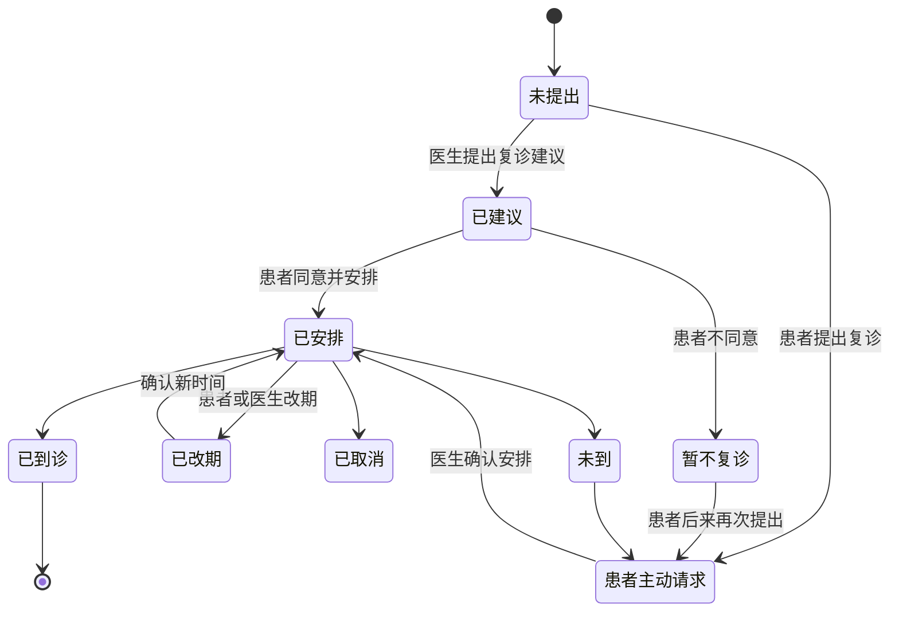
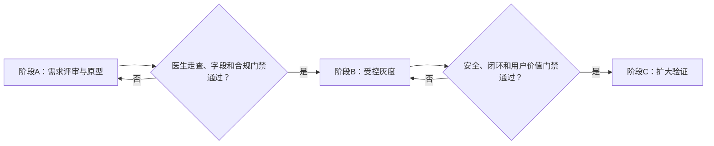

# 中医数字伴侣长期调理复诊最小闭环产品需求文档

## 0. 文档信息

| 项目 | 内容 |
|---|---|
| 文档版本 | v0.5 |
| 当前阶段 | 产品需求文档逻辑收敛稿，待产品、设计、技术、合规联合评审 |
| 产品基线 | `docs/baseline/数字伴侣-产品决策基线.md` |
| 核心场景 | 长期调理患者复诊前的信息收集与状态回顾 |
| 产品范围 | 医生联系人对话中的专业分身协助，以及医生端私人 AI 的信息支持 |
| P0 核心用户 | 独立执业或小型医馆的中医医生，长期调理患者占比较高，已存在异步沟通 |
| 主要使用者 | 中医医生 |
| 次要使用者 | 已被医生标记为客户的长期调理患者 |
| 事实状态说明 | `已确认`、`访谈证据`、`产品决策`、`待验证`、`待产品定义` |

### 0.1 文档目的

本产品需求文档将已选定的高频、高价值核心场景转化为可评审、可设计、可开发和可灰度验证的 P0 产品闭环。

本文档不重新讨论核心场景选择，也不把未验证推断写成既定事实。

### 0.2 变更记录

| 版本 | 日期 | 变更项 | 变更依据 |
|---|---|---|---|
| v0.1 | 2026-07-23 | 首次建立 P0 产品需求文档 | 已完成的用户研究、场景拆解、流程整理、知识库与 AI 工作流审查 |
| v0.2 | 2026-07-23 | 补齐医生首次使用路径；增加专业分身介入后的内容调用判断；修正个性化知识、专业能力、公共知识和患者业务记录边界；重排 P0 需求及发布阻断项 | 最新产品代入、通用 AI 编排范式、三级知识库与四类信息边界 |
| v0.3 | 2026-07-23 | 将角色边界、目标、目标用户、价值、技术约束、发布阶段、待验证问题和资料分类改为流程图或表格 | 产品评审以结构化表达为主的文档规范 |
| v0.4 | 2026-07-23 | 按“背景与证据→目标与用户→价值→方案→验证与发布”收敛阅读顺序；删除重复解释和重复行 | 文档只保留一处主定义，其余内容引用主定义 |
| v0.5 | 2026-08-25 | 将知识库建设与治理提升为专业分身开启前的正式阶段；增加知识就绪门禁、P0 最小知识切片、候选知识审核闭环、功能需求及发布阻断项 | 用户确认先完成知识治理，再运行复诊业务闭环 |

---

# 1. 摘要

本产品需求文档定义“长期调理患者复诊前的信息收集与状态回顾”P0闭环。产品先建设并治理完成本场景所需的最小知识切片，通过知识就绪门禁后，专业分身才可在医生与客户的既有对话中收集缺失事实、调用获权内容并生成草稿；诊疗、治疗方案、复诊建议和正式发送均由医生完成。

| 项目 | 定义 |
|---|---|
| 起点 | 患者反馈或提出复诊诉求，或医生主动询问 |
| 终点 | 医生完成本轮处理并发送回复，或明确进入等待补充/暂不回复状态 |
| 核心价值 | 减少散乱信息查找和重复追问，保持跨诊疗轮次的连续性 |
| 知识前置 | 专业分身开启前，P0 最小知识切片必须完成来源、分类、权限、版本、适用范围和人工审核 |
| 核心红线 | 不替代医生诊疗决策；不自动发送；主 Agent 默认不读专业内容 |
| 完整流程 | 见 7.3 |
| 状态定义 | 见 7.6 |

---

# 2. 责任角色

> 具体人员姓名待项目立项后补充。本节先固化责任角色。

| 角色 | 责任 |
|---|---|
| 产品负责人 | 产品需求文档、范围、优先级、开放问题收敛 |
| 用户研究 | P0 核心用户验证、患者侧验证、证据管理 |
| 交互设计 | 对话内介入、草稿确认、状态反馈及异常流程 |
| AI 产品/算法 | 任务识别、最小信息追问、草稿生成、边界控制 |
| 客户端研发 | 联系人对话、AI 标识、草稿编辑与发送 |
| 服务端研发 | 权限、状态机、业务记录、审计日志及数据关联 |
| 数据分析 | 埋点、灰度指标、人工修改率与持续使用分析 |
| 安全与合规 | 医疗边界、C 端 AI 标识、数据授权、留存和访问审查 |
| P0 种子医生 | 工作流验证、信息字段验证、价值与付费验证 |

---

# 3. 背景

## 3.1 已选定的核心场景

核心场景已由此前的市场与用户分析确定：

> 长期调理患者复诊前的信息收集与状态回顾。

本阶段不再比较初诊、内容创作、获客、诊所管理等其他场景。

## 3.2 用户问题

长期调理跨越多次诊疗和服药周期，患者信息持续变化。患者可能在服药后出现不舒服、效果不明显或新症状，并通过与医生的既有对话主动询问；部分医生也会主动询问患者情况。

目前问题主要表现为：

- 患者反馈散落在连续对话、病历、检查报告和医生记忆中。
- 医生需要重新寻找上一轮治疗与患者变化。
- 患者表达常不完整，医生需要来回追问。
- 每一轮治疗方案、反馈和复诊状态可能缺少明确关联。
- 沟通、诊疗决策和业务记录容易被混为同一类信息。

## 3.3 现有访谈证据及边界

| 信息 | 状态 | 可以支持的结论 | 不可以支持的结论 |
|---|---|---|---|
| 候诊阶段会提前整理既往病历、检查报告和症状细节 | 访谈证据 | 复诊准备需要调用既往资料 | 不能直接证明医生一定会查看“系统收集的信息” |
| 患者服药不适或没有效果会主动询问 | 访谈证据 | 患者主动反馈可成为闭环触发点 | 不能证明所有患者都会主动反馈 |
| 有些医生会主动询问患者 | 访谈证据 | 医生主动触发也应被流程兼容 | 不能证明主动随访是统一流程 |
| 复诊仍需重新问诊和把脉 | 访谈证据 | AI 信息支持不能替代医生诊疗 | 不能把对话记录直接当作诊断结论 |
| 患者治疗史最难获取 | 单一访谈资料 | 治疗史是优先验证的信息对象 | 不能推广为全部中医的共同首要痛点 |

## 3.4 产品架构边界

| 角色 | 服务对象 | 本场景职责 | 位置 |
|---|---|---|---|
| 主 Agent | 医生本人 | 管理专业分身元信息和路由；不执行患者服务 | 医生个人域 |
| 专业分身 | 医生的客户服务关系 | 识别任务、收集缺失事实、调用获权内容、生成草稿 | 医生与患者的联系人对话 |
| 医生 | 患者 | 查看、补问、医疗判断、确认内容并主动发送 | 联系人和最终发送者 |
| 患者 | 本人的就医需求 | 反馈、补充和提出复诊诉求 | 原医生联系人对话 |

各环节可以做与必须人工处理的边界统一见 7.8，不在角色定义中重复。

### 产品基线依据

| 基线编号 | 已确认决策 | 对本场景的约束 |
|---|---|---|
| BL-001 | 数字伴侣围绕个人事务处理、专业沉淀和受控的对外服务放大用户能力 | 主 Agent 承接医生本人事务；对患者的受控服务必须由专业分身承担 |
| BL-015 | 客户看到的发送者身份是用户；AI 生成回复需要标记 | 患者看到的联系人主体仍是医生；专业分身不是独立发送者；标记方案未确定前不得开放自动回复 |
| BL-017 | AI 推断不能直接作为用户事实写入长期记忆 | 患者反馈、AI 草稿和模型推断不得自动沉淀为长期记忆或知识 |
| BL-018 | 无代码、接口或联调证据的技术陈述不属于当前实现 | 本文功能均为目标需求，不宣称已经实现 |
| BL-022 | 主 Agent 拥有专业能力但默认不读，只知道专业分身元信息并通过接口路由 | 专业内容、患者服务内容和知识库正文由专业分身在自身内容域读取；只有医生主动调阅时才可给予主 Agent 有范围、有时效、可撤销、可审计的授权 |

## 3.5 四类信息边界

| 概念 | 定义 | 本场景示例 |
|---|---|---|
| 记忆 Memory | 会话上下文、近期事实和用户偏好 | 当前对话上下文、医生的回复偏好 |
| 知识库 KB | 经过治理、可长期调用的结构化信息资产 | 已确认流程、沟通规范、经治理的案例 |
| 能力层 Capability | Agent 的专业技能、医生经验、方法和表达能力 | 最小信息追问能力、医生表达风格 |
| 业务记录 Record | 原始业务数据和正式业务过程记录 | 患者原话、病历、报告、治疗方案、复诊状态 |

患者原始信息首先属于业务记录，不得因“AI 可检索”而自动归入知识库。

业务记录只有经过授权、脱敏、整理和人工确认后，才可成为案例知识或能力资产。

## 3.6 当前体验方案的证据状态

> 本期“中医如何首次使用数字伴侣”的路径，是产品人员基于既有产品架构进行的体验代入，尚未通过真实中医使用数据验证。

| 内容 | 当前状态 | PRD处理方式 |
|---|---|---|
| 注册后获得主 Agent | 已确认产品基线 | 作为产品前置能力，不在本 PRD 重复建设完整账号系统 |
| 创建中医专业分身 | 产品目标方案 | 纳入 P0 前置流程并验证完成率 |
| 上传历史手札 | 产品假设 | P0 先验证导入、归属确认和调用价值，不承诺自动学习 |
| 邀请患者下载、添加好友 | 产品目标方案 | 复用联系人能力；具体邀请链路读取联系人专项设计 |
| 将患者标记为客户 | 已确认产品基线 | 作为专业分身介入必要条件 |
| 在原医生对话中完成复诊前信息收集 | 已确认核心场景 | 作为本 PRD 的主验证闭环 |

本 PRD 不得用该体验代入证明“中医一定会这样使用”。灰度阶段必须观察实际创建、导入、建联和持续使用行为。

---

# 4. 目标

## 4.1 P0 目标

| 目标 | 目标结果 | 关键约束 | 主要验证指标 |
|---|---|---|---|
| O0 建立知识就绪基础 | 首批任务规则、最小信息、停止条件、回复规则和必要公共资料可被安全调用 | 未确认、无版本或含未处理患者信息的内容不得进入正式调用 | 知识就绪率、无效知识拦截数、调用可追溯率 |
| O1 跑通对话内最小闭环 | 患者不离开医生对话即可反馈、补充并收到医生回复 | 不创建独立 AI 联系人 | 闭环完成率 |
| O2 降低找信息和重复追问负担 | 医生能定位本轮反馈和关联记录 | 暂不引入完整 AI 诊疗摘要 | 人工补问次数、处理时长、核对负担 |
| O3 建立可追溯的人机边界 | AI 收集事实和生成草稿，医生决策并发送 | 医疗决策和外部发送必须人工 | 越权发送数、草稿修改程度、审计完整率 |
| O4 验证真实用户价值 | P0 医生持续使用，且认为流程有用 | 不用节省时间直接推导收入 | 7/30 日持续使用、停用恢复意愿 |

## 4.2 成功指标

首轮灰度不预设未经验证的绝对目标值。上线前先取得基线，灰度后比较变化。

| 指标 | 定义 | 用途 |
|---|---|---|
| 闭环完成率 | 进入专业分身流程后，最终由医生发送回复并记录结果的会话占比 | 验证流程可用性 |
| 有效补充率 | 专业分身追问后，患者至少补充一项医生认为有用的信息的比例 | 验证信息收集价值 |
| 医生查看率 | 含患者补充信息的会话被医生打开查看的比例 | 验证信息是否进入工作流 |
| 医生草稿采用率 | 医生最终发送内容与 AI 草稿存在可复用部分的比例 | 验证草稿价值 |
| 草稿修改程度 | AI 草稿到最终发送内容的编辑差异 | 识别准确性与风险 |
| 医生处理时长 | 从医生首次打开待处理反馈到发送回复的时长 | 观察负担变化 |
| 人工补问次数 | 医生在 AI 追问后仍需补问信息的次数 | 验证最小信息规则 |
| 7/30 日持续使用 | 种子医生持续使用该流程的比例 | 验证真实行为价值 |
| 医生主观核对负担 | 医生评价 AI 介入是减少、持平还是增加负担 | 防止伪效率 |
| 付费/继续使用意愿 | P0 医生是否愿意持续使用或付费 | 验证商业价值 |

## 4.3 非目标

P0 不包含：

- AI 自动诊断。
- AI 推荐、生成或修改治疗方案。
- AI 自动给出是否复诊、何时复诊或复诊方式。
- AI 自动识别重大病症并分诊。
- AI 自动发送医生回复。
- AI 自动生成并要求医生核对完整诊疗摘要。
- AI 自动将患者记录沉淀为知识库。
- 全诊所患者 CRM、排班、收费、库存和绩效管理。
- 获客、平台流量和医生个人 IP 运营。
- 完整的线上诊疗产品。

---

# 5. 目标用户

## 5.1 P0 核心用户

| 判断维度 | P0 特征 | 选择原因 | 验证状态 |
|---|---|---|---|
| 执业方式 | 独立执业、个体坐堂或小型医馆经营型中医 | 使用者更接近购买者，决策链短 | 待验证 |
| 患者负荷 | 有稳定患者量，接近个人时间和精力上限 | 更可能感知沟通和查找负担 | 待量化 |
| 服务类型 | 长期调理及多轮复诊患者占比较高 | 核心场景发生机会更多 | 待量化 |
| 当前行为 | 已通过微信或类似联系人对话处理诊后反馈 | 无需教育全新沟通习惯 | 访谈线索 |
| 人员配置 | 没有真人助理，或愿意尝试 AI 辅助 | AI 价值更直接 | 待验证 |
| 数字接受度 | 熟练度不必高，但愿意使用数字工具 | 降低尝试门槛 | 产品假设 |
| 购买权 | 能自行决定试用或购买 | 便于验证商业价值 | 待验证 |

## 5.2 次要用户：患者

| 条件 | 产品判断 |
|---|---|
| 已与医生建立联系人关系 | 是进入同一对话的前提 |
| 已被医生标记为客户 | 是专业分身介入门禁，不等于患者授权全部资料 |
| 已发生至少一轮诊疗 | 才能形成“状态回顾”和诊疗轮次关联 |
| 会反馈效果、不适、症状变化或复诊诉求 | 才能触发核心场景 |

## 5.3 暂不优先的用户

| 暂不优先用户 | 原因 |
|---|---|
| 一次性诊疗为主的医生 | 核心场景频率低 |
| 没有线上沟通习惯的医生 | 需要改变基础工作方式 |
| 机构采购链很长且医生无购买权 | 难以验证直接商业价值 |
| 主要需要诊所运营管理的机构 | 偏离个人数字伴侣定位 |
| 期望 AI 自动诊疗或自动处理患者的用户 | 超出产品红线 |

> “高频”和“高价值”必须按医生的真实行为逐人验证，不能由“中医”职业标签直接推出。具体问题和证据要求见附录 A。

---

# 6. 用户价值

## 6.1 价值矩阵

| 对象 | 待解决任务 | 预期价值 | 成立条件 | 验证方式 |
|---|---|---|---|---|
| 医生 | 在连续对话中找回患者变化并完成处理 | 减少查找与重复追问；保持诊疗连续；保留控制权 | 医生查看且使用信息；AI 没有增加更大核对负担 | 行为埋点、任务走查、灰度访谈 |
| 患者 | 在服药后反馈反应、效果或复诊诉求 | 不换入口即可补充信息并获得医生确认后的回复 | 患者愿意继续回答；不会误认为 AI 独立行医 | 完成率、停止回答原因、患者访谈 |
| 产品 | 验证主 Agent 与专业分身架构 | 形成可迁移的专业服务闭环 | 四类信息边界和人工决策红线成立 | 数据审计、跨场景复盘 |

## 6.2 商业价值假设

| 假设 | 当前风险 | 必须验证的行为证据 |
|---|---|---|
| 降低沟通负担可提高服务容量 | 节省时间不一定转化为更多服务或收入 | 医生如何使用释放时间；实际服务量是否变化 |
| 连续的长期调理服务可形成付费意愿 | 微信和人工记忆可能已经够用 | 停用恢复意愿、付费访谈、真实付费试验 |
| P0 医生可形成短购买链路 | 医生可能有需求但没有购买权 | 使用者、购买者和付款者是否为同一人 |

--- 

# 7. 解决方案

## 7.1 核心对象

| 对象 | 定义 |
|---|---|
| 医生联系人 | 患者看到并持续使用的医生联系人身份 |
| 专业分身 | 医生创建并授权、在对话中观察和辅助的 AI 能力 |
| 客户标记 | 医生授权专业分身介入该联系人的必要条件之一 |
| 诊疗轮次 | 一次问诊/复诊及其治疗方案、反馈和后续处理的关联单元 |
| 患者反馈 | 患者关于执行、效果、不适、新症状或复诊意愿的原始表达 |
| 最小信息 | 足以让医生理解当前任务并决定下一步所需的缺失事实 |
| AI 草稿 | 专业分身生成、尚未发送且不代表医生意见的回复建议 |
| 最终回复 | 医生查看、必要时修改并主动点击发送的内容 |
| 笔记 | 医生保存、编辑和回看的个人材料，不因上传而自动成为正式知识 |
| 个性化知识 | 医生确认、可复用、来源及适用范围明确的个人专业知识 |
| 专业能力 | 医生“怎么做”的经验、追问方法、处理范式和表达方法 |

## 7.2 介入前置条件

专业分身只有在以下条件同时满足时才可介入：

1. P0 最小知识切片已通过知识就绪门禁。
2. 医生已创建专业分身。
3. 医生已将该联系人标记为客户。
4. 当前对话属于医生与该患者的联系人对话。
5. 当前消息被识别为 P0 支持的反馈或复诊相关任务。
6. 该联系人未关闭专业分身协助。

任一条件不满足时，系统按普通联系人对话处理，不主动追问或生成面向患者的内容。

## 7.3 端到端流程



### 7.3.1 专业分身介入后的内容调用规则

本场景沿用通用 AI 编排范式：

```text
鉴权
→ 关系校验
→ 风险判断
→ 意图与回复策略识别
→ 确定完成任务所需信息
→ 选择最小获权内容范围
→ 追问或生成草稿
→ 用户确认并发送
→ 状态和审计记录
```

| 调用顺序 | 内容 | 归属 | 使用规则 |
|---:|---|---|---|
| 1 | 当前对话、患者反馈、治疗史、诊疗轮次及当前方案 | 业务记录或协作容器中的业务记录 | 只读取当前任务必要部分；保留原话、来源和确认状态 |
| 2 | 医生确认的个人知识、专业笔记结论、脱敏案例知识 | 个性化知识库 | 必须与当前任务匹配，且来源、版本、适用范围有效 |
| 3 | 医生的追问方法、处理范式、表达方法 | 专业能力层 | 只调用已获权能力；不得把方法调用结果当成医疗结论 |
| 4 | 中医通用术语、规范和基础资料 | 公共知识库 | 个性化内容不存在、不适用或不足时作为通用参考 |
| 5 | 无可靠内容 | 不调用 | 只整理患者事实并交医生处理，不生成专业判断 |

知识调用必须同时满足任务相关、主体有权、内容已确认、版本有效、范围最小和全程可审计。不同来源冲突时必须并列显示来源并交医生判断，不得由 AI 自行覆盖。

公共知识库不是医生个人内容的平替，也不能用于自动诊断、治疗方案或复诊决策。命中个性化知识或专业能力同样不能突破人工医疗决策红线。

### 7.3.2 知识建设、审核与持续治理闭环

P0 正式启用专业分身前，必须先完成与首批任务直接相关的最小知识切片，不以知识数量或文件数量作为就绪标准。



P0 最小知识切片包括：

| 资产 | 归属 | 最小就绪条件 |
|---|---|---|
| 反馈与复诊任务分类规则 | 个性化知识或专业能力 | 首批支持任务、边界和降级分支已确认 |
| 每类任务的最小信息规则 | 专业能力 | 每个追问可对应缺失事实，且不含诊断推断 |
| 追问停止条件与禁止行为 | 专业能力／安全规则 | 医生、产品和合规共同确认 |
| 医生注意事项与回复规则 | 个性化知识库 | 来源、适用范围和版本可见，医生已确认 |
| 必要中医术语、规范和安全资料 | 公共知识库 | 来源合法、版本有效、专业审核通过 |
| 反馈处理与复诊状态规则 | 协作规则或业务状态模型 | 状态含义、转换条件和人工责任已确认 |

业务运行中产生的新内容只能按“原始业务记录→脱敏候选→人工审核→正式知识或能力”流转；禁止自动学习、自动入库或跨患者直接复用。

## 7.4 功能需求

| 需求编号 | 需求名称 | 需求说明 | 业务规则与边界 | 验收标准 | 优先级 |
|---|---|---|---|---|---|
| P0-F000 | 首次使用前置路径 | 医生完成注册后获得主 Agent，可进入专业分身创建、患者建联和客户标记流程。 | 账号与联系人基础能力复用产品公共模块；本 PRD 只验收本场景所需的串联结果。 | 1. 医生可从主 Agent 或 Agent 中心进入专业分身创建。<br>2. 未完成专业分身创建时不能触发本场景 AI 介入。<br>3. 医生可以邀请患者、建立好友关系并设置客户标记。 | P0 |
| P0-F001 | 专业分身创建与启用 | 医生可创建专业分身，并查看启用状态和回复策略。 | P0 回复策略固定为“AI 草稿回复”；本期不提供自动发送。 | 1. 未创建专业分身时，客户标记不能触发 AI 介入。<br>2. 专业分身关闭后，不再对新消息触发追问或生成草稿。<br>3. 页面不提供自动发送策略。 | P0 |
| P0-F001A | 职业选择 | 创建专业分身时先从产品预设职业大类中单选，再选择具体职业“中医”。 | 本期职业选择不等于医疗资质认证；医疗/护理/制药及其具体职业范围由产品配置；会员权益差异不在本期展开。 | 1. 职业大类和具体职业均为单选。<br>2. 未提供的职业不得由模型自行生成。<br>3. 页面明确职业选择不代表平台认证。 | P0 |
| P0-F001B | 手札导入与归属确认 | 医生可上传历史手札；系统解析后由医生选择保存为笔记、候选知识或候选能力。 | 上传不等于正式入库；患者原始资料进入业务记录或待确认区；正式知识和能力必须经过来源、敏感、适用范围及人工确认。 | 1. 上传后默认状态不是“正式知识”。<br>2. 医生可查看来源材料并确认归属。<br>3. 含患者信息的材料不得静默进入可跨患者调用的知识。<br>4. 未确认内容不得参与正式调用。 | P0验证项 |
| P0-F001C | P0 知识建设与就绪门禁 | 平台和医生建设首批任务分类、最小信息、停止条件、回复规则及必要公共资料；系统在专业分身开启前检查知识就绪状态。 | 知识数量不等于就绪；每项资产必须具备归属、来源、版本、适用范围、审核状态和权限；患者业务记录不得被统计为知识资产。 | 1. 系统可显示每个 P0 知识资产的就绪与阻断原因。<br>2. 任一必需资产未审核、已失效或无权时，不得开启自主追问和 AI 草稿。<br>3. 通过门禁的资产可按任务、来源和版本追溯。<br>4. 门禁失败时降级为普通对话和人工处理。 | P0 |
| P0-F002 | 客户标记与单联系人授权 | 医生可将联系人标记为客户或取消客户标记；系统记录标记者、标记时间和状态变化。 | 客户标记是专业分身介入的必要条件；取消标记不等于删除历史业务记录。 | 1. 未标记为客户的联系人按普通对话处理。<br>2. 取消客户标记后，未发送草稿不得继续自动处理。<br>3. 历史记录按照数据权限与留存规则处理。 | P0 |
| P0-F003 | 反馈任务识别 | 专业分身识别服药后不适、没有效果、症状变化、患者主动复诊请求，以及患者对医生状态询问的回复。 | 识别结果只用于工作流路由，不属于医学判断；患者原话必须保留。 | 1. AI 改写不得覆盖患者原始消息。<br>2. 无法识别时转为普通对话或待医生查看。<br>3. 无法识别时不得生成诊疗结论。 | P0 |
| P0-F004 | 最小信息缺口判断 | 系统优先复用当前对话和已授权业务记录，只询问当前任务缺失的信息。 | 不使用固定完整问卷；不重复询问已经明确且仍有效的信息；追问仅限事实。 | 1. 每个追问可关联明确的缺失字段和当前任务。<br>2. 追问不得判断病因、证型、严重程度或治疗方案。<br>3. 同一轮次不得无理由重复提问。<br>4. 医生可以看到患者原话和补充信息。 | P0 |
| P0-F004A | 内容范围判断与调用 | 满足介入条件后，系统先确定任务所需信息，再按“患者获权业务记录→医生个性化知识与专业能力→公共知识兜底”选择内容。 | 个人知识与经验需按“知识是什么、能力怎么做”拆分；公共知识只作通用参考；无可靠内容时转医生。 | 1. 每次调用保存任务、内容类型、来源、版本、权限范围和调用结果。<br>2. 未确认候选知识不得参与正式调用。<br>3. 无有效个性化内容时才进入公共知识参考分支。<br>4. 无可靠内容时不生成专业判断。<br>5. 内容冲突时不自动覆盖。 | P0 |
| P0-F005 | 对话内事实追问 | 专业分身在医生联系人对话中提问；患者在同一对话中继续提交文字、图片或报告。 | 不创建独立 AI 联系人；患者看到的联系人主体仍是医生；AI 参与内容按获批方案标记。 | 1. 患者无需跳转独立表单即可完成流程。<br>2. AI 生成内容与医生亲自发送内容可以区分。<br>3. AI 标识不改变联系人主体。<br>4. 提交失败时患者可以获知并重试。 | P0 |
| P0-F006 | 患者与诊疗轮次关联 | 每条反馈关联患者、发生时间、提交时间、信息来源、上一诊疗轮次及相关治疗方案版本。 | 无法确定轮次时不得静默关联；自动关联置信不足时进入待确认状态。 | 1. 医生可以查看当前关联轮次。<br>2. 低置信关联显示“待确认关联”。<br>3. 医生可以人工更正。<br>4. 更正操作保留审计记录。 | P0 |
| P0-F007 | 待医生处理状态 | 最小信息已完成，或系统无法继续安全追问时，将对话标记为待医生处理。 | 医生在患者对话框中查看反馈；P0 不新增独立患者管理后台；已读不等于已处理。 | 1. 医生进入对话即可看到未处理消息及补充信息。<br>2. 医生可以标记处理中、等待患者补充或已处理。<br>3. 状态变化可以追溯。 | P0 |
| P0-F008 | 医生补充询问 | 医生可在同一对话要求患者补充信息，患者回复继续关联当前任务和诊疗轮次。 | 医生补问后进入等待患者补充状态；关联超时或语义不明确时由医生确认轮次。 | 1. 医生补问后状态变为“等待患者补充”。<br>2. 患者回复后恢复为“待医生处理”。<br>3. 无法确认关联时提示医生处理。 | P0 |
| P0-F009 | 人工诊疗决策保护 | 病症与辨证判断、治疗方案及调整、是否复诊、复诊时间和方式、不适或无效果的处理意见，均由医生决定。 | 专业分身只能基于医生已经明确的决定组织语言，不得补全医学意见。 | 1. 专业分身不能直接生成并发送医疗结论。<br>2. 涉及治疗或复诊的草稿必须有医生已确认内容作为来源。<br>3. 没有医生决定时不得生成确定性医学意见。 | P0 |
| P0-F010 | AI 回复草稿 | 医生完成决定后，专业分身可生成未发送的回复草稿；医生可以修改、放弃或重新生成。 | 草稿不代表医生意见；患者不可见未发送草稿；AI 推断不能写成医生已确认事实。 | 1. 草稿明确显示“AI 草稿”和“未发送”。<br>2. 患者看不到未发送草稿。<br>3. 治疗方案和复诊安排只能引用医生已确认字段。 | P0 |
| P0-F011 | 医生确认与主动发送 | 医生查看草稿后主动点击发送；确认草稿与发送消息是两个不同动作。 | 系统不得因定时、退出页面或确认草稿自动发送；最终发送者身份为医生。 | 1. 发送前展示最终内容。<br>2. 只有医生点击发送才产生正式消息。<br>3. 发送失败时保留内容和失败状态，并允许重试。<br>4. 对方看到的发送者是医生。 | P0 |
| P0-F012 | 审计记录 | 系统保存患者原始消息、AI 原始草稿、医生修改、最终内容、关键操作时间，以及对应患者、对话、任务和诊疗轮次。 | 医生修改不能覆盖 AI 原始草稿；内部审计日志仅限授权角色和用途访问。 | 1. 最终内容可以追溯至医生发送动作。<br>2. AI 原始草稿与医生修改分别保留。<br>3. 普通用户不可见内部审计日志。<br>4. 日志访问受权限控制。 | P0 |
| P0-F013 | 本轮状态与下一轮 | 本轮处理后记录是否进入下一诊疗轮次，并支持已安排、已确认、改期、取消、未到和已到诊等状态。 | 未安排复诊也可结束本轮；患者此前拒绝或后来未到，不影响之后重新提出复诊。 | 1. 患者确认后未到不得记为已复诊。<br>2. 患者此前拒绝复诊后仍可重新提出。<br>3. 没有复诊建议时可正常结束。<br>4. 新一轮可以关联上一轮记录。 | P0 |

## 7.5 最小信息规则

### 7.5.1 定义

“最小信息”指：

> 足以帮助医生理解当前反馈、决定是否继续补问并采取下一步处理的缺失事实。

它不是：

- 完整病历。
- 固定全量问卷。
- AI 完成诊断所需信息。
- 医疗充分性的证明。

### 7.5.2 候选字段

| 任务 | 优先复用 | 仅在缺失时询问 |
|---|---|---|
| 一般效果反馈 | 患者、上一轮方案、治疗时间 | 当前变化、变化开始时间、是否仍持续、是否希望医生回复 |
| 服药后不适 | 上一轮方案、用药记录 | 具体表现、出现时间、实际执行情况、是否自行停药/调整、是否同时使用其他药物 |
| 无效果/效果不明显 | 上一轮症状与方案 | 哪项症状无变化、实际执行时长、是否按方案执行、是否出现其他变化 |
| 主动要求复诊 | 上一轮记录 | 复诊原因、较上次的变化、新增报告、希望的线上/线下方式与时间 |

### 7.5.3 规则限制

- 具体必填字段需由 P0 医生逐项验证。
- 图片、报告只作为业务记录保存，AI 不在 P0 中作医学结论。
- 患者不愿继续填写时，保留原始反馈并交给医生处理。
- 对话内容足以表达事实时，不强制结构化重填。

## 7.6 状态模型

### 7.6.1 反馈处理状态



### 7.6.2 复诊状态



## 7.7 数据与资料归属

| 信息 | 初始归属 | 是否进入记忆 | 是否直接进入知识库 | 是否进入能力层 |
|---|---|---:|---:|---:|
| 患者原始消息 | 业务记录 | 可作当前会话上下文 | 否 | 否 |
| 患者基本资料 | 业务记录 | 可按需读取 | 否 | 否 |
| 病历、检查报告 | 业务记录 | 可按需读取 | 否 | 否 |
| 每轮症状变化 | 业务记录 | 可作近期事实 | 否 | 否 |
| 治疗方案及版本 | 业务记录，医生确认 | 可作当前轮次上下文 | 否 | 否 |
| 复诊建议和状态 | 业务记录，医生确认 | 可作近期事实 | 否 | 否 |
| 已确认复诊流程 | 产品/组织规则资产 | 可作为任务上下文 | 是 | 可作为流程能力 |
| 经脱敏、整理、确认的历史案例 | 治理后的案例资产 | 否 | 是 | 可供能力调用 |
| 医生的表达风格 | 个人能力资产 | 可记录偏好 | 视产品定义 | 是 |
| 医生保存的原始手札 | 笔记或导入资料 | 可作为当前导入上下文 | 未确认前否 | 未确认前否 |
| 医生确认的手札知识结论 | 个性化知识 | 否 | 是 | 只有“怎么做”的方法部分可进入 |
| 医生确认的追问和处理方法 | 专业能力 | 否 | 否 | 是 |
| AI 草稿和医生修改 | 审计业务记录 | 可用于当前任务 | 不自动进入 | 不自动学习 |

### 7.7.1 三级知识库暂定映射

| 层级 | 暂定内容 | 本产品需求文档约束 |
|---|---|---|
| 公共知识库 | 经确认的行业规范、术语和公开规则 | P0 不用于自动医疗决策 |
| 个性化知识库 | 医生授权并治理后的个人知识和案例索引 | 不等于患者原始档案 |
| 协作知识库 | 经授权共享的协作知识及其容器 | P0 聚焦医患协作容器；容器内的治疗方案、反馈和复诊状态仍属于业务记录，不因位于协作空间而变成知识 |

本产品需求文档采用以下正式边界：

> 患者档案属于业务记录；知识库只保存经治理的知识资产或经授权的索引。

> 知识回答“是什么”；能力回答“怎么做”。医生确认的知识结论进入个性化知识库，医生的追问方法、处理范式和表达方法进入专业能力层。

## 7.8 AI 与人工边界

| 环节 | AI 可做 | 必须人工 |
|---|---|---|
| 反馈识别 | 识别任务类型、路由 | 对医学含义作最终判断 |
| 信息收集 | 复用已知事实、追问缺失事实 | 决定是否还需医学信息 |
| 内容调用 | 按任务、权限和有效性调用业务记录、个性化知识、专业能力及公共知识 | 处理来源冲突；判断资料是否足以支持医疗处理 |
| 信息展示 | 展示原话、字段与关联记录 | 阅读并判断信息是否可信 |
| 诊疗 | 提供已授权资料检索入口 | 问诊、把脉、辨证、诊断 |
| 治疗方案 | 记录医生明确输入 | 制定、修改、确认 |
| 复诊建议 | 记录并组织医生明确决定 | 是否复诊、时间、方式 |
| 回复 | 生成未发送草稿 | 修改、确认、主动发送 |
| 知识沉淀 | 标记候选材料 | 授权、脱敏、审核、确认入库 |

### 7.8.1 “医生完成必要处理”的产品定义

“必要处理”不是一个由系统自动推断的医学完成状态。P0 按医生行为和可验证结果判断：

| 情况 | 医生必须完成的动作 | 后续状态 |
|---|---|---|
| 还需患者补充 | 医生明确提出补充要求并发送 | 等待患者补充 |
| 需要回复且已形成意见 | 医生明确输入或确认本次要表达的事实、处理意见及必要的复诊决定 | 可以生成 AI 草稿 |
| 医生不使用 AI 草稿 | 医生取消该条目标消息的草稿 | 仅表示该消息无需 AI 回复；不自动标记已处理 |
| 医生亲自回复 | 医生编辑并主动点击发送 | 发送成功后记录为已处理 |
| 暂不回复 | 医生未发送任何正式消息 | 保留业务反馈状态；不得因已读、取消草稿或超时自动关闭 |

医疗内容是否充分、是否需要诊疗、如何治疗以及是否复诊均由医生判断。产品只记录医生的明确行为和状态，不替医生判定“医学处理已经完成”。

## 7.9 异常与降级

| 情况 | P0 处理 |
|---|---|
| 未创建专业分身 | 普通联系人对话，不介入 |
| 联系人未标记为客户 | 普通联系人对话，不介入 |
| AI 无法识别意图 | 保留原话，交由医生查看 |
| 患者拒绝补充 | 停止追问，标记待医生处理 |
| 患者连续发送多条消息 | 合并到当前任务需保留原始消息顺序 |
| 无法判断诊疗轮次 | 标记待确认，不自动错误关联 |
| 医生长期未处理 | P0 仅展示待处理状态；提醒策略待定义 |
| 草稿生成失败 | 医生可直接手动回复 |
| 发送失败 | 保留最终内容和失败状态，允许重试 |
| 患者改期、取消或未到 | 更新复诊状态，不覆盖原始安排 |
| 患者无复诊安排但再次咨询 | 作为新反馈或复诊请求重新触发 |

## 7.10 技术与产品要求

| 类别 | 要求 | 验收门禁 |
|---|---|---|
| 权限 | 只有医生可创建和配置自己的专业分身 | 非所有者写操作为 0 |
| 权限 | 只有医生或明确授权角色可标记客户 | 每次变化记录操作者和时间 |
| 权限 | 专业分身只访问当前任务所需且已授权的数据 | 跨医生、跨患者越权读取为 0 |
| 权限 | 主 Agent 默认只读专业分身元信息和授权汇总 | 未主动授权时读取专业正文次数为 0 |
| 数据 | 原始数据、结构化字段、AI 产物和人工确认结果分层保存 | 任一最终回复可追溯至原始消息、草稿和用户发送动作 |
| 数据 | 每条信息记录来源、提交时间、发生时间、更新时间、确认状态、敏感程度和诊疗轮次 | 必填元数据缺失时不得成为正式知识 |
| 数据 | 治疗方案、复诊建议和最终回复保留版本 | 修改不覆盖历史版本 |
| 可用性 | AI 不可用时仍可使用普通对话 | AI 故障不阻断医生手动回复 |
| 可用性 | 结构化失败不能阻断医生处理 | 保留原话并提供人工路径 |
| 可用性 | 医生可忽略、取消或改写 AI 草稿 | 不存在强制采纳 |

## 7.11 埋点与验证

### 核心事件

| 阶段 | 事件 |
|---|---|
| 专业分身创建 | `professional_avatar_creation_started`、`profession_selected`、`avatar_created` |
| 手札导入 | `handnote_imported`、`import_destination_confirmed` |
| 知识建设与就绪 | `knowledge_candidate_created`、`knowledge_reviewed`、`knowledge_version_activated`、`knowledge_readiness_checked`、`knowledge_readiness_blocked` |
| 医患建联 | `patient_invited`、`friend_relation_established`、`contact_marked_customer` |
| 任务识别 | `feedback_task_detected` |
| 内容调用 | `knowledge_scope_selected`、`personal_knowledge_called`、`professional_capability_called`、`public_knowledge_fallback_called`、`knowledge_call_degraded_to_human` |
| 信息补充 | `minimum_info_question_sent`、`patient_supplement_submitted` |
| 医生处理 | `feedback_marked_pending_doctor`、`doctor_opened_feedback`、`doctor_requested_more_info` |
| 草稿与发送 | `ai_draft_generated`、`ai_draft_edited`、`doctor_send_clicked`、`doctor_reply_sent` |
| 状态与纠错 | `followup_status_changed`、`treatment_round_link_corrected` |

灰度访谈问题与所需证据统一见附录 A。

## 7.12 需求追溯

| 用户事实/产品决策 | 对应需求 |
|---|---|
| 医生注册后拥有主 Agent，并创建中医专业分身 | P0-F000、P0-F001、P0-F001A |
| 手札上传不等于正式知识入库 | P0-F001B |
| 完成最小知识切片治理后才开启专业分身追问和草稿 | P0-F001C |
| 业务记录只能经脱敏、分类和人工审核后成为正式知识或能力 | P0-F001B、P0-F001C、P0-F012 |
| 患者通过原有对话反馈 | P0-F003、P0-F005 |
| 专业分身是透明观察者 | P0-F001、P0-F005 |
| 创建分身并标记客户后才介入 | P0-F001、P0-F002 |
| 介入后先判断任务所需内容范围 | P0-F004A |
| 个性化知识和专业能力优先，公共知识作为通用参考 | P0-F004A |
| 患者补充信息仍发在对话中 | P0-F005、P0-F008 |
| 医生在患者对话框查看 | P0-F007 |
| AI 只生成草稿 | P0-F010 |
| 医生主动点击发送 | P0-F011 |
| 诊疗方案和复诊建议人工决策 | P0-F009 |
| 患者确认后可能违约 | P0-F013 |
| 未同意复诊后仍可能再次复诊 | P0-F013 |
| AI 摘要可能增加核对负担 | 非目标、成功指标 |
| 主 Agent 不是患者管理工具 | 3.4 产品架构边界 |

---

# 8. 发布计划

## 8.1 建议结论

建议进入产品需求阶段并开展原型及技术评审，但不建议直接进入全量开发。

原因：

- 核心场景、角色、入口、AI 回复策略和人工决策边界已足够清晰。
- 最小闭环已成立，可以拆成功能和状态。
- 仍有若干会影响交互、数据和合规的 P0 问题必须在开发承诺前收敛。

## 8.2 发布阶段



| 阶段 | 范围或输出 | 退出条件 |
|---|---|---|
| A 需求评审与原型 | P0 最小知识切片及就绪门禁；患者对话内 AI 标识和追问原型；医生处理、补问、草稿及发送原型；状态模型；对象和权限模型 | 5—8 位 P0 医生完成任务走查；明确查看信息的时机和原因；确认首批任务及最小字段；所有必需知识资产通过来源、版本、权限、适用范围和人工审核检查；完成 AI 标识和数据处理初审 |
| B 受控灰度 | 少量种子医生和长期调理患者；只开启 AI 草稿；不开放自动医疗判断和自动发送 | 越权发送为 0；未经医生确认的医疗结论发送为 0；全链路可完成；有效补充、医生查看及持续使用出现正向证据；核对负担未显著上升 |
| C 扩大验证 | 更多病种或调理场景；医生主动询问；主 Agent 授权汇总；案例知识治理；机构协作 | 依据阶段 B 数据另行制定，不在本期预设 |

## 8.3 P0 发布阻断项

以下问题未确认前，不应进入完整开发承诺：

| 编号 | 待确认问题 | 影响 |
|---|---|---|
| B01 | C 端 AI 标识的具体位置、文案和持续展示方式 | 患者认知、合规、信任 |
| B02 | 医生将联系人标记为客户时，是否需要患者告知或授权 | 权限、合规、交互 |
| B03 | 各任务的最小信息必填项和追问上限 | 对话体验、模型规则 |
| B04 | 消息自动关联诊疗轮次的规则和人工纠错入口 | 数据准确性 |
| B05 | 哪些消息进入“待医生处理”，普通消息如何降级 | 工作量、漏处理风险 |
| B06 | 医生长期未处理时是否提醒、提醒谁、提醒频率 | 主 Agent 与专业分身边界 |
| B07 | 草稿版本和审计日志的留存期限及访问权限 | 技术、隐私、合规 |
| B08 | 患者数据的授权、删除、导出和跨端同步规则 | 数据治理 |
| B09 | 手札中同时包含个人知识、能力方法和患者信息时，产品如何拆分、展示和逐项确认归属 | 产品架构、数据模型、交互 |
| B10 | 新建下一轮和关闭本轮的判定规则 | 状态机、数据关联 |
| B11 | P0 医生的购买者是否就是使用者 | 商业验证 |
| B12 | 医疗安全降级与紧急情况文案是否需要专业合规方案 | 安全与责任边界 |
| B13 | P0 最小知识切片的责任人、来源、版本、适用范围、有效期、审核方式与失效降级规则 | 知识治理、AI 安全、发布门禁 |

## 8.4 P1 以后评估

| 后续方向 | 进入条件 |
|---|---|
| 经医生主动授权的随访任务 | P0 证明主动触达有价值且合规 |
| 更完整的复诊日程协同 | 复诊安排和状态规则稳定 |
| 业务记录转案例知识 | 授权、脱敏、审核和版本流程确定 |
| 服务量、复诊率和收入授权汇总 | 主 Agent 的读取授权和统计口径确定 |
| 机构级协作知识库 | 个人场景闭环通过后另行验证组织需求 |
| 非医疗事务的有限自动执行 | 权限、风险和审计规则通过 |

P1 仍继承 4.3 的非目标，不因版本升级自动开放医疗决策或自动发送。

---

# 附录 A：当前待验证的用户价值问题

| 编号 | 待验证问题 | 主要对象 | 建议证据 |
|---|---|---|---|
| V01 | P0 医生是否会在真实工作中打开并使用专业分身收集的信息？ | 医生 | 查看和后续处理行为 |
| V02 | 医生是立即查看、集中查看，还是候诊时查看？ | 医生 | 时间埋点、情境访谈 |
| V03 | 哪些患者反馈最常见，频率分别是多少？ | 医患对话 | 脱敏样本统计 |
| V04 | 哪些补充信息会改变医生的下一步处理？ | 医生 | 个案回放、医生标注 |
| V05 | 患者是否愿意回答追问，停止回答的根本原因是什么？ | 患者 | 回答完成率、退出访谈 |
| V06 | AI 追问是否减少重复沟通？ | 医生 | 现状与灰度补问次数对比 |
| V07 | AI 草稿的修改和核对是否抵消其价值？ | 医生 | 修改程度、处理时长、主观负担 |
| V08 | 释放时间被用于什么，是否改变服务能力或收入？ | 医生 | 时间用途和服务量记录 |
| V09 | 使用者是否有购买权，实际付费决策者是谁？ | 医生/机构 | 决策链访谈、付费试验 |
| V10 | 不同 P0 医生的价值差异由哪些变量造成？ | 医生分群 | 逐人行为与结果对照 |

# 附录 B：信息分类与业务对象

## B.1 常用资料

| 资料 | 复诊时处理 |
|---|---|
| 患者姓名 | 确认身份 |
| 出生年月日/年龄 | 确认是否变化或纠错 |
| 性别 | 确认或纠错 |
| 既往病史 | 确认是否新增 |
| 过敏信息 | 确认是否新增或订正 |
| 既往病历 | 按需查看 |
| 检查报告 | 按需查看并确认是否有新增版本 |
| 已记录症状细节 | 作为对比基线 |

## B.2 多次迭代资料

| 资料 | 更新规则 | 确认主体 |
|---|---|---|
| 本次诉求 | 每轮新增 | 患者自述 |
| 主要症状及开始/持续时间 | 按发生时间新增 | 患者自述、医生确认 |
| 改善、无变化、加重或新症状 | 按反馈新增，不覆盖旧状态 | 患者自述、医生判断 |
| 当前实际用药 | 按实际执行新增 | 患者自述 |
| 脉象、气色等医生采集信息 | 按诊疗轮次新增 | 医生 |
| 服药执行情况 | 按反馈新增 | 患者自述 |
| 服药后不适或异常反应 | 按发生时间新增 | 患者自述、医生处理 |
| 新增检查报告 | 保留原件和版本 | 患者提交 |
| 治疗方案及版本 | 每次修改形成新版本 | 医生 |
| 注意事项 | 每次修改形成新版本 | 医生 |
| 复诊建议及复诊状态 | 建议与行为状态分别记录 | 医生、患者、系统事实 |

## B.3 难找资料

| 资料 | 当前证据 | 待验证 |
|---|---|---|
| 患者治疗史 | 单一访谈提出“最难获取” | 出现频率、分散来源、查找步骤、时间成本和实际用途 |

## B.4 信息附加标签

| 标签 | 作用 |
|---|---|
| 信息来源 | 区分患者、医生、系统或外部材料 |
| 提交时间 | 记录进入系统时间 |
| 实际发生时间 | 建立真实时间线 |
| 确认状态 | 区分患者自述、AI 候选、医生确认和正式归档 |
| 最后更新时间 | 判断是否过期 |
| 敏感程度 | 控制读取、展示和审计 |
| 诊疗或复诊轮次 | 建立跨轮次关联 |
| 当前有效状态 | 区分有效、失效、冲突和待确认 |
