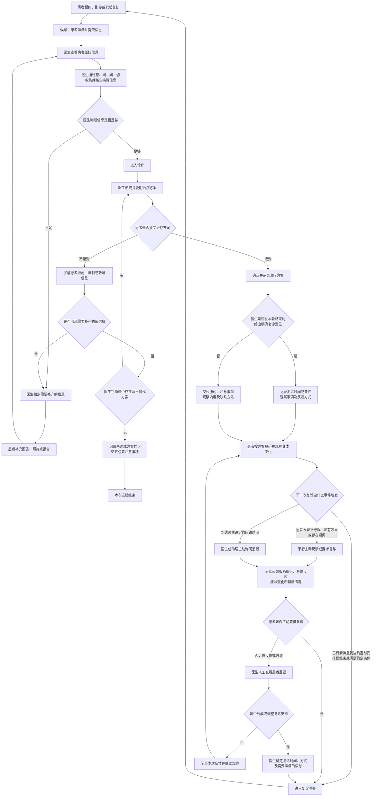
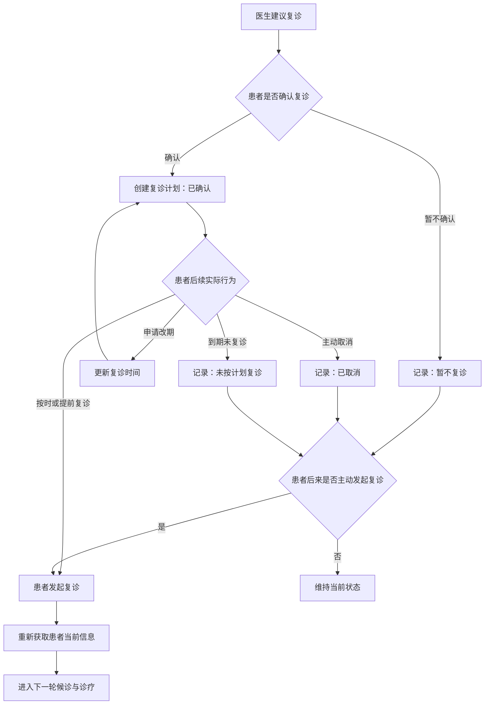

# 中医患者诊疗与复诊——完整流程

## 文档信息

| 项目 | 内容 |
|---|---|
| 文档类型 | 用户场景与业务流程定义 |
| 文档状态 | 待验证流程稿 |
| 版本 | v0.1 |
| 更新时间 | 2026-07-22 |
| 核心场景 | 患者服药后的反应记录、效果反馈与复诊再评估 |

> 本文整理现阶段已经拆解出的业务流程。诊疗过程中具体的辨证方法和治疗手段暂不展开；治疗方案和复诊建议必须由医生人工决策。AI可以在诊疗阶段提供信息辅助，但不作最终医学决策。“重大情况”的定义、识别规则和处理方式目前没有访谈证据或产品定义，暂不纳入已确认流程。

## 1. 流程目标

建立以下连续闭环：

> 患者提供信息 → 医生诊疗 → 医生制定治疗方案 → 患者确认方案 → 患者服药并观察 → 患者反馈反应和效果 → 患者复诊 → 医生再次问诊和把脉 → 制定下一阶段方案。

每一轮复诊都必须重新获取患者当前信息，不能直接沿用上一次状态。

## 2. 参与角色

| 角色 | 主要职责 |
|---|---|
| 患者 | 提供真实信息，确认治疗和复诊安排，服药并观察身体变化，实际发起复诊 |
| 医生 | 判断信息是否足够，完成诊疗，制定治疗方案，判断是否复诊及复诊要求 |
| 主伴侣 | 面向医生本人管理个人日程、收入、复诊率分析及专业分身授权，不直接执行患者管理 |
| 医生专业分身 | 作为医患联系人对话中对患者透明的观察者，在医生授权范围内收集和调取诊疗相关信息、执行提醒和复诊资料收集；C端按当前政策要求显示AI标识，不形成独立联系人、不作最终医学决策 |
| 系统 | 保存、传递、提醒、集中呈现原始信息并记录状态与操作日志 |

## 3. 患者信息分类

### 3.1 常用信息

相对稳定、医生经常需要查看，复诊时只需确认是否变化：

- 患者姓名；
- 出生年月日／年龄；
- 性别；
- 既往病历；
- 检查报告；
- 已记录的症状细节。

### 3.2 多次迭代信息

随每次诊疗、服药和复诊持续变化，必须按时间新增记录：

- 本次诉求；
- 病历：
  - 主要症状；
  - 症状开始和持续时间；
  - 症状改善、无变化、加重或新出现；
  - 当前实际用药；
  - 脉搏；
  - 气色；
- 服药执行情况；
- 服药后不适或异常反应；
- 新增检查报告；
- 治疗方案及版本；
- 注意事项；
- 复诊建议及复诊状态（待验证）。

其中，脉搏和气色属于诊疗过程中产生或确认的信息，具体由谁采集、如何记录以及患者能否自行提交，待产品定义。

### 3.3 难找的信息

- 患者治疗史。

> **访谈证据**：访谈资料中，受访中医提出患者治疗史是最难获取的信息。当前尚未补充受访者数量、出现频次、原始引语和具体上下文，因此暂不外推为所有中医的共同结论，也暂不扩展治疗史的具体字段。

### 3.4 信息附加标签

每条信息同时记录：

- 信息来源；
- 提交时间和发生时间；
- 患者自述或医生确认；
- 最后更新时间；
- 敏感程度；
- 对应的诊疗或复诊轮次。

## 4. 完整主流程

## 5. 候诊阶段

### 5.1 患者动作

- 确认常用信息；
- 整理既往病历、检查报告和当前用药；
- 填写本次诉求、主要症状及症状时间；
- 上传或携带必要照片和资料；
- 完成签到；
- 按叫号提示到对应诊室等候。

### 5.2 系统或助理动作

- 提供填写和上传入口；
- 检查必填字段是否为空；
- 提示尚未提交的材料；
- 协助操作困难的患者；
- 完成签到、叫号和诊室指引；
- 将患者原始信息集中呈现给医生。

### 5.3 阶段输出

形成一组待医生查看和确认的诊前资料。系统只能检查字段是否填写，不能判断医学信息是否足够。

## 6. 诊疗阶段

医生查看诊前资料，通过望、闻、问、切四诊合参继续收集和核实信息。

### 6.1 信息不足循环

> 医生查看 → 判断信息不足 → 指定补充内容 → 患者补充 → 医生再次查看。

补充任务需要明确：补充什么、以什么形式提供、是否必须、何时提交，以及无法提供时如何标记。

### 6.2 AI介入边界

AI可以：

- 辅助查找历史资料；
- 集中展示患者原始信息；
- 提示哪些内容仍待医生确认；
- 记录医生输入的结果。

AI不能：

- 作出最终病症判断；
- 作出最终医学判断；
- 制定或确认最终治疗方案；
- 决定是否复诊及复诊时间；
- 将生成内容未经医生确认作为正式医学结论。

## 7. 治疗方案确认分支

治疗方案必须由医生人工制定，并由患者确认是否接受。

### 7.1 患者接受

- 医生确认并记录方案；
- 交代执行方法和注意事项；
- 确定需要观察的内容；
- 进入服药观察阶段。

### 7.2 患者不接受

先了解原因：不理解、担心风险、费用或时间限制、执行困难、个人偏好、需要与家人讨论、希望寻求其他意见，或出现此前未提供的信息。

- 出现新信息：返回信息补充环节；
- 存在适当替代方案：医生重新提出方案，由患者再次确认；
- 无法达成一致：记录结果并交代必要注意事项，本次流程结束。

患者方案状态包括：已接受、部分接受、待确认、请求替代方案、明确拒绝、无法执行、信息补充中。

## 8. 服药与观察阶段

### 8.1 患者记录内容

- 是否开始并按要求服药；
- 是否漏服、中止、停药或换药；
- 原有症状是否改善、无变化或加重；
- 是否出现新症状；
- 是否出现服药后不适；
- 不适的具体表现、出现时间和持续情况；
- 当前是否同时使用其他药物；
- 医生上次要求观察的事项；
- 新增报告、照片和患者疑问。

患者只描述自身真实感受，不自行判断不适是否由药物引起。

### 8.2 双向反馈触发

患者回家服药后的反馈可以由两方发起：

- **患者主动发起**：出现不舒服、效果不明显、原症状加重、新症状或其他疑问时主动询问医生；
- **医生主动发起**：到达医生设定的观察或回访时间后，由医生或助理主动询问患者服药执行、身体反应和症状变化。

即使患者已经进入长期调理，医生也不一定在每轮问诊结束时给出明确复诊意见。患者主动反馈时，可以直接提出复诊请求；患者如果只是咨询或反馈，则由医生查看后判断是否需要形成新的复诊安排，或调整已有安排。

### 8.3 需要人工处理的反馈

患者报告不舒服或其他变化时，系统可以记录和传递信息。是否需要提前复诊或采取其他安排，由医生人工判断；是否需要建立优先级规则，待产品另行定义。

## 9. 复诊意见、触发事件与患者行为

### 9.1 复诊建议

当前核心场景已经限定为长期调理患者，但医生不一定在每轮问诊结束时给出明确复诊意见。因此，需要同时支持“已有复诊安排”和“尚无明确复诊安排”两条路径。

医生如果在问诊结束时给出复诊意见，需要人工决定并记录：

- 下一次复诊时间或触发条件；
- 线上或线下方式；
- 复诊前需要观察什么；
- 需要准备哪些信息；
- 哪些情况需要提前联系医生。

需要区分：

- **复诊意见**：医生在问诊结束时或收到患者反馈后，确定下一次复诊时间或条件、方式和准备信息；
- **复诊请求**：由患者在服药后不舒服、没有效果或存在其他需求时主动发起。

患者主动发起复诊请求属于复诊触发事件。患者可能在已有安排下要求提前复诊，也可能在没有明确安排时主动发起。请求发起后，需要重新获取患者当前信息。

### 9.2 复诊触发事件

下一次复诊可能由以下事件触发：

- 在已有安排时，到达医生设定的复诊时间；
- 一个疗程结束；
- 满足医生设定的其他复诊条件；
- 患者服药后不舒服、没有效果或出现其他问题，主动要求提前复诊；
- 医生或助理主动询问后，医生决定形成新的复诊安排或调整已有安排。

### 9.3 患者意愿与实际行为分离

患者确认复诊只代表当时意愿，不代表实际完成；患者当时不同意，也不代表以后不会主动复诊。

## 10. 改期与重新复诊的处理策略

### 10.1 系统可以自动处理

同时符合以下条件时，可以按医生预设规则自动改期或预约：

- 仍在医生设置的有效时间范围内；
- 复诊方式没有变化；
- 患者未报告新的或加重的情况；
- 本次诉求与原复诊目标一致；
- 关键病史、过敏和当前用药未发生变化；
- 存在可预约时间。

### 10.2 转人工处理

出现以下情况时转医生：

- 超出有效时间范围；
- 患者多次改期；
- 症状加重或出现新情况；
- 出现新的不适、过敏或用药变化；
- 本次诉求与原复诊目标不同；
- 无法判断属于复诊还是新的诊疗；
- 需要决定复诊方式或其他医学安排。

排班问题可以按规则自动处理，医学适用性、复诊方式和其他医学安排由医生决定。

## 11. 必须人工处理的节点

| 节点 | 人工责任人 |
|---|---|
| 判断医学信息是否足够 | 医生 |
| 病症与辨证判断 | 医生 |
| 制定治疗方案 | 医生 |
| 判断是否存在适当替代方案 | 医生 |
| 是否结束长期调理、不再进入下一复诊周期 | 医生 |
| 复诊时间、方式和观察事项 | 医生 |
| 患者是否接受治疗方案 | 患者 |
| 患者是否确认复诊 | 患者 |
| 患者是否改期、取消或重新发起 | 患者 |

核心责任原则：

> 系统负责收集、传递、提醒和记录；AI可以提供信息辅助；医生负责医学判断与诊疗决策；患者负责提供信息并作出个人选择。

## 12. 核心状态

### 12.1 治疗方案状态

- 已接受；
- 部分接受；
- 待确认；
- 请求替代方案；
- 明确拒绝；
- 无法执行；
- 信息补充中。

### 12.2 复诊意愿状态

- 待确认；
- 已确认；
- 暂不复诊；
- 主动重新发起。

### 12.3 复诊计划状态

- 未创建；
- 已创建；
- 已改期；
- 已取消；
- 已过期；
- 已完成。

### 12.4 信息状态

- 待补充；
- 已提交；
- 待医生确认；
- 医生已确认；
- 医生已修正；
- 无法提供；
- 不再需要。

## 13. 当前最小闭环

当前最小闭环收敛为：

> 医生完成本轮诊疗并交代服药、观察事项和联系方法，可选择给出或暂不给出明确复诊意见 → 患者服药并观察 → 已有安排到期、患者主动反馈或医生主动询问触发复诊 → 患者提交本周期信息 → 医生回顾患者状态 → 患者实际复诊 → 医生再次问诊与把脉 → 形成下一阶段方案，并再次决定是否给出明确复诊意见。

问诊结束时可能存在复诊意见，也可能没有明确安排。患者反馈不舒服、没有效果或其他问题时可以直接要求复诊；如果患者只是反馈，则由医生判断是否形成新的复诊安排或调整已有安排。

其中：

- 诊疗手段暂不展开；
- AI摘要、自动变化归纳和自动异常结论暂不作为已确认手段；
- 治疗方案和复诊建议必须由医生人工决策；
- 患者确认复诊与实际复诊必须分开记录；
- 患者拒绝、取消或未按计划复诊后，仍可主动重新发起；
- 每次重新发起复诊，都从获取患者当前信息开始。
