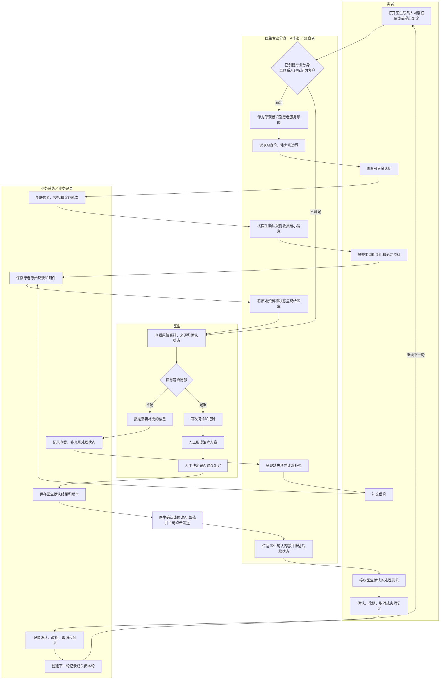
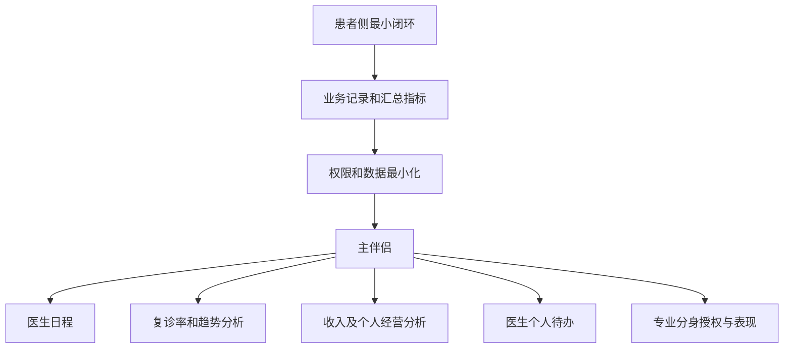

# 中医数字伴侣——最小闭环泳道与数据流

## 文档信息

| 项目 | 内容 |
|---|---|
| 文档类型 | 核心场景最小闭环／角色泳道／数据流 |
| 文档状态 | 产品边界已确认，流程细节待验证 |
| 版本 | v0.5 |
| 更新时间 | 2026-07-23 |
| 核心场景 | 长期调理患者复诊前的信息收集与状态回顾 |
| 关联文档 | [中医复诊前信息收集与状态回顾-用户场景](中医复诊前信息收集与状态回顾-用户场景.md)、[中医患者诊疗与复诊-完整流程](中医患者诊疗与复诊-完整流程.md)、[中医核心场景-记忆与三级知识库映射规范](中医核心场景-记忆与三级知识库映射规范.md)、[中医数字伴侣-知识库与AI工作流审查报告](中医数字伴侣-知识库与AI工作流审查报告.md) |

> [!IMPORTANT] 核心边界
> 主伴侣是医生本人的私人AI，不是诊所患者管理系统。医生专业分身以带有AI标识的观察者身份面向患者，协助医生对外服务。治疗方案和复诊建议始终由医生人工决定。

## 1. 文档目的与范围

本文用于：

1. 将已选定的核心场景落成最小闭环；
2. 明确患者、医生专业分身、医生、业务系统和主伴侣的职责；
3. 标记每一步读取和写入什么信息；
4. 区分记忆、知识库、能力层和业务记录；
5. 明确AI可以执行、需要医生确认和暂不实施的节点。

本文不展开：

- 具体辨证和治疗手段；
- AI诊断和自动处方；
- 诊所经营管理系统；
- 多医生排班和机构级患者管理；
- AI摘要和自动医疗风险判断。

## 2. 信息与决策依据

### 2.1 已确认产品决策

- 核心场景已经选定，不再重新开放场景选择；
- 当前场景没有真人助理角色；
- 主伴侣面向医生本人；
- 医生专业分身以观察者身份面向患者；
- C端对话暂时显示AI标识；
- 专业分身不提供独立入口，而是作为旁观者存在于医生与患者的联系人对话框；
- 专业分身介入的前提是主用户已经创建专业分身，并将该联系人标记为客户；
- 患者反馈、资料补充和医生处理均在同一个医患对话框中完成；
- 当前患者的AI回复策略为“AI 草稿回复”时，专业分身先生成草稿，由医生确认后再进入发送环节；
- 医生确认或修改AI 草稿后，必须由医生主动点击发送；系统不得自动发送；
- 专业分身优先复用已有业务记录，只在同一医患对话中补齐当前任务缺少的最小信息；
- 默认不使用固定完整问卷，不重复询问已有资料；
- 专业分身对患者不形成独立角色，患者感知为在医生本人联系人会话中沟通；
- C端按当前政策要求显示AI标识，但不要求患者理解内部的草稿、确认和调用过程；
- 系统内部必须保留AI 草稿、医生修改、医生确认和医生直接发送的状态与日志；
- 治疗方案必须由医生人工决策；
- 复诊建议必须由医生人工决策；
- AI摘要暂不作为已确认的实行手段；
- 患者病历、报告、反馈、日程和状态首先属于业务记录。

### 2.2 当前访谈支持

- 患者服药后不舒服或认为没有效果时，可能主动询问或要求复诊；
- 有的医生会主动询问患者服药后的情况；
- 医生不一定在每轮诊疗结束时给出明确复诊意见；
- 候诊阶段需要准备既往病历、检查报告和症状细节；
- 患者实际复诊后，医生仍会再次问诊和把脉；
- 一位受访中医提出患者治疗史最难获取。

### 2.3 仍不能直接推导

- 所有患者都会提前提交资料；
- 所有医生都会在复诊开始前查看资料；
- AI摘要一定降低工作量；
- 医生会在固定时间主动回访全部患者；
- 系统可以自主判断病情严重程度；
- 节省时间一定增加医生收入。

## 3. 角色及系统边界

| 角色／组件 | 面向对象 | 最小闭环职责 | 不承担 |
|---|---|---|---|
| 患者 | 医生及专业分身 | 提交真实信息、确认个人选择、实际复诊 | 医学判断 |
| 医生专业分身 | 医患联系人对话 | 作为对患者透明的旁观者辅助信息收集、提醒和草稿回复；C端按政策显示AI标识 | 成为独立联系人、改变医生对话主体、治疗和复诊决策 |
| 医生 | 患者及诊疗过程 | 查看资料、补充问诊、诊疗、治疗方案和复诊决策 | 将专业责任转交AI |
| 业务系统 | 流程和数据 | 身份关联、记录、状态、权限、日志和预约请求 | 医学判断 |
| 主伴侣 | 医生本人 | 日程、收入、复诊率分析、个人事务、专业分身授权 | 直接执行患者管理 |
| 知识库 | Agent | 提供经过治理的长期信息资产 | 保存全部原始病历 |
| 能力层 | 专业分身 | 提供医生确认的方法、经验和表达方式 | 保存单个患者原始记录 |

## 4. 最小闭环的起点和终点

### 4.1 起点

出现以下任一事件：

1. 已有医生复诊安排即将到期；
2. 患者服药后主动反馈不适、效果或新症状；
3. 患者主动提出复诊请求；
4. 医生决定了解某位患者的当前状态。

患者不需要寻找独立的专业分身入口，直接进入原有医生联系人对话框。只有同时满足以下条件时，专业分身才可介入：

1. 医生作为主用户已经创建对应专业分身；
2. 医生已经将该联系人标记为客户；
3. 当前对话符合医生为该患者设置的AI回复策略。

### 4.2 终点

满足以下任一条件：

- 医生完成复诊并形成下一阶段治疗方案；
- 医生决定暂不复诊，患者继续观察；
- 患者取消或暂不继续，当前状态被记录；
- 医生确认本轮长期调理结束。

无论进入哪种终点，都必须保留本轮业务记录和处理状态。

## 5. 最小闭环泳道



## 6. 主伴侣与最小闭环的关系

主伴侣不出现在患者侧执行泳道中。它只在医生侧读取经过授权的个人事务和汇总结果。



主伴侣默认不需要：

- 与患者直接对话；
- 读取完整病历正文；
- 向患者发送提醒；
- 创建患者资料收集任务；
- 替医生作出复诊或治疗决定。

## 7. 节点级信息读写

| 节点 | 读取 | 写入 | 归属 | 确认要求 |
|---|---|---|---|---|
| 患者发起反馈 | 患者身份、当前协作入口 | 原始反馈、发生时间、诉求 | 业务记录 | 保留患者自述 |
| 专业分身收集 | 医生确认的信息收集规则 | 回答、附件、缺失字段 | 业务记录 | 不自动转成医疗事实 |
| 身份和轮次关联 | 患者索引、现有诊疗轮次 | 关联结果 | 业务记录 | 低置信度时人工确认 |
| 医生查看 | 原始信息、来源、治疗史视图 | 查看时间和操作日志 | 业务记录 | 无 |
| 医生要求补充 | 当前资料和医生判断 | 补充要求 | 业务记录／协作视图 | 医生确认 |
| 再次诊疗 | 本轮资料、医生授权的知识和能力 | 医生观察与诊疗记录 | 业务记录 | 医生确认 |
| 治疗方案 | 医生诊疗结果 | 方案和版本 | 正式业务记录 | 医生确认 |
| 复诊建议 | 本轮处理结果 | 时间、条件、方式和准备信息 | 正式业务记录 | 医生确认 |
| 专业分身传达 | 医生确认内容 | 发送和阅读状态 | 协作视图／业务记录 | 必须显示来源状态 |
| 患者确认或改期 | 当前安排 | 患者行为状态 | 业务记录 | 行为事实 |
| 本轮结束 | 所有状态 | 下一轮关联或关闭状态 | 业务记录 | 按规则归档 |

## 8. “最小信息”的定义

“最小信息”是指：

> 为了让医生理解患者本次反馈、判断是否需要补充信息并决定后续处理，当前任务不可缺少的最少上下文。

它不是：

- 要求患者重新填写完整病历；
- 医学上已经足够作出判断的保证；
- 所有患者统一填写的固定长表；
- AI可以据此自行判断病情的字段集合。

### 8.1 患者不需要重复填写的信息

如果系统已经能够从联系人和业务记录中可靠获得，则不应再次询问：

- 患者姓名；
- 医患联系人关系；
- 对应医生；
- 最近一次诊疗时间；
- 已经关联的当前治疗轮次。

### 8.2 当前反馈任务的最小信息

| 信息 | 用途 | 当前状态 |
|---|---|---|
| 本次反馈或诉求的原始描述 | 保留患者真实表达 | MVP必需 |
| 反馈类型 | 区分不适、无效果、症状变化、一般疑问或复诊请求 | 按任务识别 |
| 发生时间或持续时间 | 建立时间关系 | 按医生规则补充 |
| 实际治疗／服药执行情况 | 避免把未执行、部分执行和正常执行混为一谈 | 按任务补充 |
| 是否自行调整、中止或同时使用其他药物 | 解释当前上下文 | 按医生规则询问 |
| 图片、报告等原始附件 | 提供患者愿意提交的相关材料 | 按场景可选 |
| 是否希望医生查看或申请复诊 | 明确患者当前任务 | MVP必需 |

最小信息采用“已有资料优先＋按任务补缺”的方式，不采用所有患者统一填写的完整问卷。不同反馈类型的具体必需字段仍需由P0医生基于真实案例配置和验证。系统只能检查字段是否已经提交，医学信息是否足够仍由医生判断。

### 8.3 按任务补充信息

| 当前任务 | 优先补充的信息 |
|---|---|
| 一般反馈 | 患者当前主要诉求、发生时间、是否仍在发生、是否希望医生回复 |
| 服药后不舒服 | 具体表现、出现时间、实际服药情况、是否自行调整或停药、是否同时使用其他药物 |
| 认为没有效果 | 哪项症状没有变化、实际执行时间、是否按原方案执行、是否出现其他变化 |
| 主动申请复诊 | 本次复诊诉求、相对上次的主要变化、新增报告、希望的复诊方式和时间 |

专业分身只收集患者事实，不判断不适原因、病情严重程度或是否应该复诊。

## 9. 四类信息在闭环中的作用

| 类型 | 闭环中的作用 | 示例 |
|---|---|---|
| 记忆 | 保持近期会话和交互连续 | 患者刚刚补充了报告；医生偏好先看原始材料 |
| 知识库 | 提供长期、经过治理的信息资产 | 公共专业资料、已确认服务规则 |
| 能力层 | 让专业分身按医生的方法协助工作 | 医生确认的信息收集方法、表达方式 |
| 业务记录 | 保存患者和诊疗过程的原始事实与结果 | 病历、报告、反馈、治疗方案、复诊状态 |

## 10. AI介入和人工边界

### 10.1 专业分身可以执行

- 显示AI身份和能力边界；
- 识别反馈、资料补充或复诊请求；
- 按医生已确认规则询问必要信息；
- 关联授权范围内的患者和诊疗轮次；
- 展示原始资料、来源和确认状态；
- 传达医生已经确认的内容；
- 推进患者确认、改期和资料补充；
- 记录操作和状态。

### 10.2 必须由医生执行

- 判断医学信息是否足够；
- 判断病症和辨证；
- 制定、修改和确认治疗方案；
- 解释患者不适的医学原因；
- 决定是否需要复诊；
- 决定复诊方式、时间或条件；
- 确认可沉淀为专业能力的经验。

### 10.3 当前暂不实施

- AI摘要替代原始信息；
- 自动判断重大情况；
- 自动给出治疗或复诊建议；
- 自动将业务记录写入知识库或能力层；
- 跨患者自动发现医疗规律；
- 专业分身以医生本人身份发言。

## 11. C端感知与内部消息状态

### 11.1 C端感知

- 患者始终进入医生本人的联系人对话框；
- 专业分身不以独立联系人或独立角色出现；
- 患者感知为正在与医生本人沟通；
- 当前因政策要求，对话中显示AI标识；
- 患者无需理解AI 草稿、医生确认或能力调用等内部过程；
- 患者需要医生处理时，直接在该对话中发送消息，无需额外的“转医生”入口。

### 11.2 系统内部状态

虽然C端不需要展示全部内部状态，系统仍必须区分并记录：

| 内部状态 | 含义 |
|---|---|
| AI 草稿 | 专业分身生成，尚未向患者发送 |
| 医生已修改 | 医生修改过AI 草稿 |
| 医生已确认 | 医生确认草稿可以发送 |
| 医生直接发送 | 医生未使用草稿，直接回复 |
| 等待医生处理 | 患者消息已进入医生对话，但尚未处理 |

当前已确认的回复策略：

```text
患者在医患对话框发送反馈
→ 专业分身以旁观者身份生成AI回复草稿
→ 医生查看草稿
→ 医生确认或修改
→ 医生主动点击发送
→ 最终内容进入医患对话
```

“AI 草稿回复”不等于AI已经向患者发送。医生仅查看、修改或保存草稿都不会触发发送，只有主动点击发送才会将最终内容写入医患对话。C端对话主体保持为医生本人，AI标识具体样式仍待产品确认。

待确认的交互规则：

- AI标识持续显示还是仅首次提示；
- 医生确认状态采用何种视觉样式；
- “请求医生查看”入口放在哪里；
- 等待医生处理时如何向患者说明；
- 医生未处理时是否提醒医生以及提醒频率。

## 12. MVP范围

### 12.1 必须实现

- 患者身份和诊疗轮次关联；
- 医生联系人对话框作为患者唯一入口；
- 专业分身创建状态和客户联系人标记校验；
- C端AI身份显示；
- 最小信息收集；
- 原始文字、图片和报告保存；
- 患者自述与医生确认状态区分；
- 医生查看和补充要求；
- AI 草稿回复、医生修改和确认；
- 医生主动点击发送；
- 医生确认治疗结果和复诊建议；
- 专业分身传达医生确认内容；
- 复诊请求、安排、改期和实际到诊分离；
- 权限、版本和操作日志；
- 主伴侣只读取医生侧授权汇总信息。

### 12.2 暂不实现

- 完整诊所患者管理；
- 复杂机构和多医生权限；
- AI诊疗摘要；
- 自动医疗优先级；
- 自动经验沉淀；
- 内容/IP运营；
- 主伴侣直接面向患者。

## 13. 已确认问题与待确认问题

### 13.1 已确认

| 编号 | 问题 | 当前答案 | 状态 |
|---|---|---|---|
| Q1 | 无明确复诊安排时，患者从哪里找到专业分身入口？ | 直接使用医生联系人对话框；专业分身作为医患对话中的旁观者 | 已确认 |
| Q2 | 专业分身介入对话的前提是什么？ | 主用户已创建专业分身，并将该联系人标记为客户 | 已确认 |
| Q4 | 医生在哪里查看待处理反馈？ | 患者反馈就是医患对话消息，医生打开对应患者对话框查看 | 已确认 |
| Q5 | 医生要求补充后，患者如何收到并继续提交？ | 补充要求和患者新增资料继续在同一对话中发送 | 已确认 |
| Q6-a | 为什么医生需要确认专业分身回复？ | 该患者使用“AI 草稿回复”策略，专业分身只生成草稿 | 已确认 |
| Q6-b | 医生确认或修改草稿后如何发送？ | 由医生主动点击发送，系统不得自动发送 | 已确认 |
| Q3 | 最小信息如何收集？ | 优先使用已有业务记录，在同一对话中按当前任务补齐最少缺失信息；不使用固定完整问卷 | 已确认 |

### 13.2 部分确认

| 编号 | 已确认部分 | 尚未确认 |
|---|---|---|
| Q3-a | 已确认采用“已有资料优先＋按任务补缺”原则 | 每类任务的具体必需字段仍需P0医生用真实案例配置 |
| Q6-c | 医生主动点击发送后，最终消息进入医生联系人对话 | AI标识的具体样式和位置 |

### 13.3 P0：仍需确认的闭环问题

- [ ] 各任务的具体必需字段由P0医生如何配置？
- [ ] 医生将联系人标记为客户时，是否需要客户同意或收到提示？
- [ ] 未创建专业分身或未标记为客户时，患者消息按什么普通对话规则处理？
- [x] 医生确认或修改AI 草稿后，由医生主动点击发送，系统不得自动发送；
- [ ] 医生修改草稿后，是否保存原草稿、修改内容和确认记录？
- [ ] 本轮关闭后，患者再次反馈创建新轮次还是继续原轮次？

### 13.4 P0：身份和医生处理

- [ ] AI标识的具体样式和持续时间是什么？
- [ ] AI生成、医生确认和医生本人消息如何区分？
- [x] 患者无需请求切换角色，直接在医生联系人对话框发送消息即向医生发起沟通；
- [ ] 哪些患者消息必须进入医生待处理列表？
- [ ] 等待医生处理时，患者看到什么状态？

### 13.5 P1：资料与分析

- [ ] 专业分身可读取业务记录的具体范围是什么？
- [ ] 主伴侣复诊率分析需要哪些最小汇总字段？
- [ ] 收入分析的数据来源和授权是什么？
- [ ] 协作视图关闭后的保存和访问规则是什么？
- [ ] 哪些业务记录可以成为候选知识或候选能力？

## 14. 当前结论

当前最小闭环不是“主伴侣管理患者”，而是：

> 患者继续使用原有医生联系人对话框，并感知为与医生本人沟通；专业分身不形成独立角色，只作为对患者透明的旁观者协助工作，C端因当前政策要求显示AI标识。采用AI 草稿回复策略时，专业分身只生成草稿，医生查看或修改后必须主动点击发送，系统不得自动发送。患者直接在该对话中发送消息即向医生发起沟通，不需要额外的人工介入入口。

## 15. 版本记录

| 版本 | 日期 | 变更内容 | 变更依据 |
|---|---|---|---|
| v0.1 | 2026-07-23 | 建立核心场景最小闭环泳道、节点读写、AI边界和主伴侣隔离关系 | 已确认产品边界及现有用户研究 |
| v0.2 | 2026-07-23 | 明确联系人对话框入口、专业分身介入条件、同一对话内反馈与补充，以及AI 草稿回复策略；补充最小信息定义 | 用户确认的Q1、Q2、Q4、Q5和Q6部分答案 |
| v0.3 | 2026-07-23 | 明确专业分身对患者透明、对话主体保持为医生本人，患者无需额外请求医生介入；AI标识仅按当前政策要求显示 | 用户对患者感知边界的确认 |
| v0.4 | 2026-07-23 | 明确医生确认或修改AI 草稿后必须主动点击发送，系统不得自动发送 | 用户确认的AI 草稿发送规则 |
| v0.5 | 2026-07-23 | 确认最小信息采用已有业务记录优先、按任务补缺、同一对话收集且不使用固定完整问卷 | 用户确认的Q3产品原则 |
