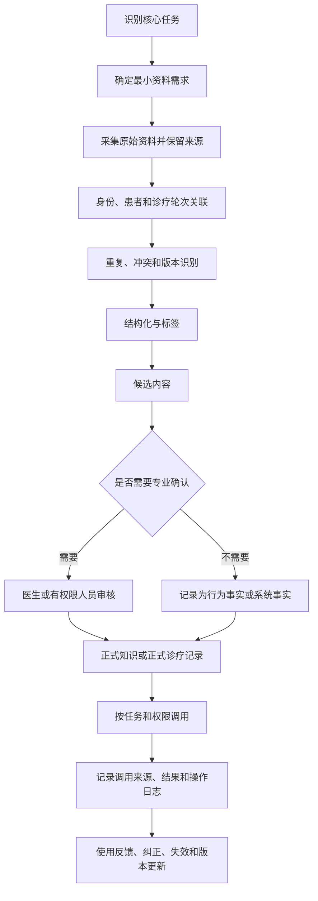
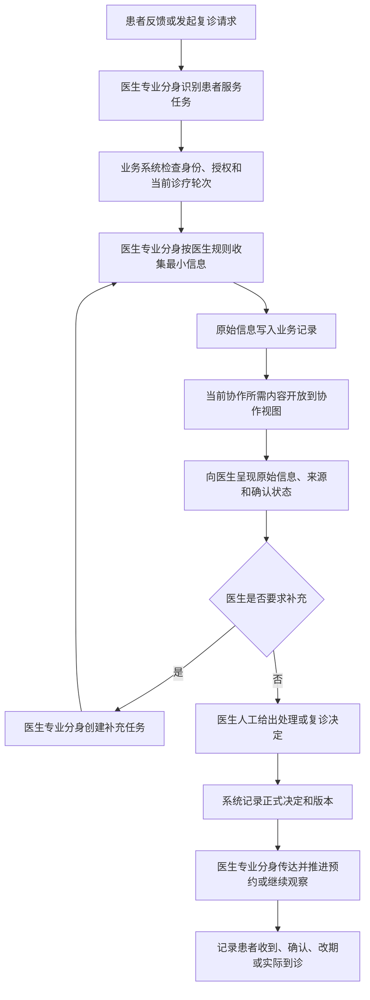

# 中医数字伴侣——知识库与AI工作流审查报告

## 文档信息

| 项目 | 内容 |
|---|---|
| 文档类型 | 参考流程与现有研究文件审查 |
| 文档状态 | 待产品确认稿 |
| 版本 | v0.10 |
| 更新时间 | 2026-07-23 |
| 顶层依据 | `数字伴侣记忆系统技术方案 v1.0` |
| 审查目标 | 让中医使用数字伴侣，并明确资料归属、知识治理和AI介入工作流 |
| 审查文件 | [中医用户画像与ICP-问题诊断及验证计划](中医用户画像与ICP-问题诊断及验证计划.md)、[中医复诊前信息收集与状态回顾-用户场景](中医复诊前信息收集与状态回顾-用户场景.md)、[中医患者诊疗与复诊-完整流程](中医患者诊疗与复诊-完整流程.md)、[长期调理复诊核心场景-待确认问题](长期调理复诊核心场景-待确认问题.md)、[中医核心场景-记忆与三级知识库映射规范](中医核心场景-记忆与三级知识库映射规范.md) |

> [!IMPORTANT] 工作口径
> 本文严格区分参考流程、访谈事实、顶层设计、已确认产品决策、产品推导和待验证假设。参考流程不是用户证据，顶层设计中的示例也不是中医真实业务规则。

## 1. 文档目的与范围

本文用于：

1. 保存用户给出的知识库搭建、AI介入和MVP落地参考流程；
2. 审查昨天形成的信息分类和中医场景文件；
3. 区分哪些内容已有依据，哪些只是产品推导；
4. 找出缺失的业务流程、资料字段和知识治理规则；
5. 为下一轮资料归属演练和用户验证提供依据。

本文不是：

- 已完成验证的产品需求文档；
- 医疗诊疗规范；
- 完整技术实现方案；
- 对全部中医工作方式的归纳；
- AI可以作出医疗决策的授权文件。

## 2. 信息与证据来源说明

| 来源 | 材料性质 | 可支持什么 | 不能支持什么 | 使用等级 |
|---|---|---|---|---|
| 用户本次提供的参考流程 | 产品方法设想 | 审查知识治理和落地步骤 | 不能证明医生实际需要或流程高频 | 产品输入／待验证 |
| 现有中医用户访谈陈述 | 单次或少量定性资料 | 形成场景、问题和访谈假设 | 不能外推到全部中医 | 访谈证据／样本有限 |
| `数字伴侣记忆系统技术方案 v1.0` | 顶层技术设计 | 约束记忆、三级知识库、主伴侣和子分身关系 | 其中示例不能自动成为中医业务规则 | 顶层设计依据 |
| 昨天整理的五份中医文档 | 基于访谈和讨论形成的二次整理 | 检查内部一致性、缺失和待验证项 | 不能当作新的独立用户证据 | 研究与产品推导 |
| 本审查报告 | 对上述材料的综合分析 | 形成修改建议和验证计划 | 不能替代真实用户验证 | 产品审查／待确认 |

### 2.1 当前已有的访谈事实

以下仅代表当前访谈输入：

- 一位受访中医提出患者治疗史最难获取；
- 访谈资料提出，候诊阶段需要提前整理既往病历、检查报告和症状细节；
- 患者服药后感到不舒服或认为没有效果时，可能主动询问或要求复诊；
- 有的医生会主动询问患者服药后的情况；
- 长期调理患者并不一定在每轮问诊结束时获得明确复诊意见；
- 患者实际复诊后，医生还会再次问诊和把脉。

### 2.2 当前已确认的产品边界

- 当前场景不存在真人助理角色；
- “长期调理患者复诊前的信息收集与状态回顾”已经选定为最高频、最高价值核心场景，并作为最小闭环范围；
- 主伴侣是医生本人的私人AI，不是诊所患者管理系统；
- 主伴侣面向医生本人，关注日程、收入、复诊率分析及个人事务；
- 医生专业分身以观察者身份面向患者，协助医生完成诊疗相关提醒、反馈和复诊信息收集；
- 专业分身对患者透明，不形成独立角色或联系人；
- 患者感知为在医生本人联系人对话中沟通；
- C端按当前政策要求显示AI标识；
- AI 草稿、医生修改和确认等状态在系统内部区分并留痕，不要求全部展示给患者；
- 患者使用原有医生联系人对话框，专业分身作为旁观者存在于医患对话；
- 只有主用户已创建专业分身且联系人已标记为客户，专业分身才可介入；
- 当前策略为AI 草稿回复，医生需要查看、修改或确认草稿；
- 医生确认或修改AI 草稿后必须主动点击发送，系统不得自动发送；
- 最小信息优先复用已有业务记录，在同一医患对话中按当前任务补缺，不采用固定完整问卷；
- 记忆、知识库、能力层和业务记录必须严格区分；
- 治疗方案必须由医生人工决策；
- 复诊建议必须由医生人工决策；
- AI摘要暂不作为已确认的实行手段；
- “重大情况医生优先处理”目前没有证据，不作为已确认规则；
- 诊疗具体手段暂不展开；
- 首版围绕最小场景建设，不先建设大而全的知识库。

## 3. 信息使用规则

### 3.1 可以用于当前产品设计的内容

| 内容 | 可支持的设计判断 | 使用限制 |
|---|---|---|
| 患者信息分散 | 需要验证集中关联和查找路径 | 尚缺真实路径、频率和耗时数据 |
| 治疗史难找 | 建立治疗史字段和来源调研 | 当前仅有单个访谈输入 |
| 患者和医生都可能发起反馈 | 流程必须支持双向触发 | 发生比例和触发规则未知 |
| 每轮不一定有复诊建议 | 不能默认生成固定复诊计划 | 仍需验证各类医生的实际做法 |
| 医生再次问诊和把脉 | AI不能用历史资料替代本轮诊疗 | 具体诊疗手段不展开 |
| 顶层三级知识库 | 使用公共、个性化、协作三层归属 | 机构资料归属仍待确认 |
| 主伴侣与子分身架构 | 问答、流程、调用应作为能力模式 | 具体权限和实现仍需定义 |

### 3.2 不能直接转化为需求的内容

| 内容 | 不能直接采用的原因 | 当前处理 |
|---|---|---|
| “该场景在所有细分中医群体中都同样高频、高价值” | 缺少分群后的复诊量和处理耗时 | 核心场景选择不变，继续量化适用人群和价值强度 |
| “治疗史是所有中医最难获取的信息” | 样本不足 | 继续访谈验证 |
| “AI摘要能够节省时间” | 可能增加核对负担 | 后置对照实验 |
| “AI能够判断重大情况” | 无定义、规则和责任依据 | 不进入当前流程 |
| “固定时间自动回访” | 医生不一定每轮给出复诊意见 | 仅作为可选路径 |
| “节省时间能够增加收入” | 取决于医生经营和承载情况 | 与用户价值分开验证 |
| “目标市场属于医生知识库” | 属于产品研究知识域 | 进入产品研究库 |
| “未敲定资料应全部移除” | 会破坏证据、候选方案和版本追溯 | 进入候选区并标记状态 |

### 3.3 信息记录规范

后续新增信息必须同时标明：

- 原始来源；
- 材料性质；
- 对应样本或文档；
- 原始陈述与产品解释；
- 当前确认状态；
- 可支持的设计判断；
- 使用限制；
- 关联场景和诊疗轮次；
- 最后更新时间；
- 变更原因。

## 4. 总体结论

当前工作已经形成了可继续验证的核心场景和较完整的诊疗—反馈—复诊流程，但尚未形成一套完全一致的“资料分类—知识归属—AI调用—人工确认—结果回写”体系。

最主要的五个问题是：

1. “常用、多次迭代、难找”描述的是资料使用特征，不是知识类型，也不是知识库层级；
2. 参考流程把“搭好完整知识库”设为AI介入前置条件，与“先验证最小场景”冲突；
3. “规则流程、历史案例、目标市场”混合了医疗运行知识和产品研究知识；
4. 现有文件仍残留真人助理角色，与已确认的产品角色边界冲突；
5. 现有流程描述了业务步骤，但缺少完整的知识写入、确认、调用、冲突处理和回写流程。

当前不应继续增加资料数量，而应先建立一个统一的多维资料模型，并用真实患者资料完成归属演练。

## 5. 对参考流程的审查

### 5.1 可以保留的部分

| 参考内容 | 审查结论 | 保留方式 |
|---|---|---|
| 知识分散在多个工具和人的脑中 | 合理的问题假设 | 通过真实医生的资料路径验证 |
| 没有系统化整理 | 合理的问题假设 | 观察查找步骤、重复记录和版本冲突 |
| 缺少调用规则 | 符合数字伴侣架构需要 | 转化为任务、权限、来源和人工确认规则 |
| 先跑最小闭环 | 与当前工作方向一致 | 保留为落地原则 |
| 去重、标签、权限 | 属于必要治理能力 | 扩充为版本、来源、状态、授权和审计体系 |
| 灰度测试并优化 | 合理 | 先验证用户价值，再验证AI能力 |

### 5.2 需要修正的部分

| 编号 | 原参考流程 | 问题 | 修正建议 | 依据 |
|---|---|---|---|---|
| R-01 | 首要是知识库搭建 | 容易先建大库、后找场景 | 先选场景，再建设最小知识切片 | 当前MVP工作原则 |
| R-02 | 搭好知识库是AI介入的必要条件 | 问答、流程和工具调用并非都需要完整知识库 | 按任务确定最低信息与规则依赖 | 产品架构推导 |
| R-03 | 常用、多次迭代、难找作为分类 | 三者不互斥；治疗史既常用、持续更新，也可能难找 | 将其定义为资料使用标签 | 现有资料分析 |
| R-04 | 真正有价值的知识只有三类 | 缺少权威专业知识、方法论和已确认决策 | 扩为医疗运行知识与产品研究知识两个知识域 | 顶层设计 |
| R-05 | 目标市场进入知识库 | 对产品团队有价值，但不应进入医生专业分身的医疗知识范围 | 放入产品研究库 | 知识域隔离 |
| R-06 | 移除一切没有敲定的资料 | 会丢失访谈证据、异议、候选方案和历史版本 | 未确认资料进入候选区，不能直接删除 | 顶层设计的版本与冲突机制 |
| R-07 | 去除重复资料 | 未定义主记录和版本关系，可能误删不同时间的有效事实 | 去重改为识别重复、合并引用、保留来源 | 医疗时间序列要求 |
| R-08 | 每份资料打多个标签 | 标签不能替代实体关系、时间、版本和权限 | 使用结构化字段加标签 | 知识调用需要 |
| R-09 | 权限管控 | 只提出“有权限”，没有权限动作和使用目的 | 拆为查看、写入、确认、分享、导出、训练 | 最小权限原则 |
| R-10 | 问答、流程、调用是三类角色 | 这是三种能力模式，不是三个产品角色 | 主伴侣协调，专业分身执行专业任务，系统调用工具 | 当前产品架构 |
| R-11 | 灰度测试AI准确率 | 过早聚焦AI能力 | 先验证医生是否查看、患者是否提交、净任务成本是否下降 | 用户价值优先 |

### 5.3 参考流程缺少的治理步骤

参考流程只有“收集—整理—调用”，还缺少：



## 6. 对昨天信息分类的审查

### 6.1 “常用信息”的问题

当前列入常用信息的内容包括姓名、年龄、性别、既往病历、检查报告和已记录症状。

存在的问题：

- 姓名、出生日期、性别是相对稳定的患者实体属性；
- 既往病历是按诊疗轮次产生的历史事件集合；
- 检查报告是带时间、机构和版本的原始文档；
- 已记录症状是带发生时间和确认状态的临床事实。

这些内容不能只因为“经常查看”就使用相同的数据结构。

建议拆为：

| 信息结构 | 示例 |
|---|---|
| 患者实体属性 | 姓名、出生日期、性别、联系方式 |
| 健康背景事实 | 既往病史、过敏史 |
| 原始文档 | 检查报告、照片、外部病历 |
| 诊疗事件 | 每次问诊、检查、治疗和复诊 |
| 症状观察 | 症状、出现时间、变化和来源 |

“常用”只作为调用频率标签。

### 6.2 “多次迭代信息”的问题

当前多次迭代信息同时包含：

- 患者自述；
- 医生观察；
- 正式病历；
- 治疗方案；
- 注意事项；
- 复诊建议；
- 业务状态。

这些信息的责任人和确认要求不同，不能放在同一状态模型中。

建议拆为：

| 类型 | 示例 | 写入者 | 是否需要医生确认 |
|---|---|---|---|
| 患者报告 | 症状变化、服药执行、不适 | 患者 | 保留自述状态 |
| 医生观察 | 脉象、气色、问诊发现 | 医生 | 医生直接确认 |
| 专业决策 | 治疗方案、复诊建议 | 医生 | 必须 |
| 共享说明 | 注意事项、准备材料 | 医生确认后由系统传达 | 必须 |
| 行为状态 | 确认、改期、取消、到诊 | 患者或系统 | 不属于医疗确认 |
| 原始材料 | 图片、检查报告 | 患者或外部来源 | 保留来源，医生按需确认含义 |

“多次迭代”只作为更新频率和版本策略标签。

### 6.3 “难找的信息”的问题

“治疗史”不是单一信息字段，而是跨时间、跨机构、跨工具形成的聚合视图，可能包括：

- 治疗时间；
- 诊疗机构和医生；
- 当时诉求与症状；
- 诊断或辨证记录；
- 处方、药物或其他治疗方法；
- 实际执行情况；
- 治疗反应和效果；
- 不适或停止原因；
- 资料来源和可信状态。

因此，“难找”应被定义为查找路径复杂度标签，不能作为第三种内容类型。

> [!WARNING] 证据限制
> “患者治疗史最难获取”目前来自一位受访中医的陈述，缺少样本数、发生频率、原始引语和具体影响，不应直接转化为全量产品字段。

### 6.4 建议的统一多维资料模型

一条资料至少需要同时回答以下维度：

| 维度 | 可选值示例 |
|---|---|
| 内容结构 | 实体属性、事实、事件、原始文档、专业决策、任务、状态 |
| 使用特征 | 常用、多次迭代、查找路径复杂 |
| 所属空间 | 公共知识库、个性化知识库、协作知识库、专业能力层、产品研究库 |
| 来源 | 患者、医生、外部机构、系统、AI、权威资料 |
| 确认状态 | 原始、患者自述、AI候选、待医生确认、已确认、已订正、失效 |
| 时间 | 提交时间、实际发生时间、生效时间、失效时间 |
| 关联对象 | 患者、医生、诊疗轮次、治疗方案、反馈事件、复诊计划 |
| 访问动作 | 查看、写入、确认、分享、导出、用于训练 |
| 敏感与保存 | 敏感等级、保存期限、删除／订正规则 |

## 7. 逐份文件发现的问题

### 7.1 `中医用户画像与ICP-问题诊断及验证计划`

| 问题 | 状态 | 建议 |
|---|---|---|
| 仍多次以“没有助理／完整助理团队”作为筛选条件 | 与“没有真人助理角色”不完全一致 | 区分真实市场是否存在助理与本产品场景不设置助理角色；不能直接全部删除市场事实 |
| 仍出现“AI助理”表达 | 与主伴侣＋专业分身架构不一致 | 改为数字伴侣或医生专业分身 |
| “判断哪些患者需要优先关注”尚无规则和证据 | 待验证 | 不进入MVP承诺 |
| ICP仍以信息管理和购买权组合得较紧 | 可能过早收窄 | 用户价值验证与商业验证分开 |
| 现有替代方案仍未获得真实使用数据 | 关键缺口 | 记录微信、纸质病历、系统和人工记忆的实际路径 |

### 7.2 `中医复诊前信息收集与状态回顾-用户场景`

| 问题 | 状态 | 建议 |
|---|---|---|
| 场景起点偏向“已准备复诊” | 与患者服药反馈主动触发复诊的访谈资料不完全覆盖 | 增加反馈入口与预约入口两条子流程 |
| 触发条件仍包含固定复诊日期和疗程结束 | 可以存在，但不是每轮必有 | 标记为可选路径 |
| MVP从“医生创建复诊时间”开始 | 无法覆盖没有预设复诊意见的患者 | 改为反馈事件或复诊任务任一触发 |
| 复诊前模板字段较多 | 尚未证明每项会影响医生行为 | 由医生按场景配置最小字段 |
| 集中展示原始资料的净价值仍未验证 | 核心假设 | 观察医生是否真实查看及总任务时间 |

### 7.3 `中医患者诊疗与复诊-完整流程`

| 问题 | 状态 | 建议 |
|---|---|---|
| Mermaid和正文仍出现“医生或助理” | 与已确认角色冲突 | 改为医生主动发起，主伴侣按医生规则执行通知 |
| “系统或助理动作”仍存在 | 角色冲突 | 拆为主伴侣、专业分身和系统动作 |
| 患者主动要求复诊后直接进入复诊准备 | 省略预约可用性与是否需要医生确认 | 分离复诊请求、复诊安排和实际到诊 |
| 自动改期条件包含医学条件 | 系统无法自行确认症状是否变化 | 先询问事实；出现变化则转医生，不自动作医学判断 |
| 没有明确“患者是否实际开始执行治疗方案” | 服药观察起点不清 | 增加获得方案、开始执行、中止或未执行状态 |
| 没有反馈处理状态和医生响应结果 | 可能产生反馈已提交但无人处理 | 增加待查看、处理中、已回复、需补充、已关闭 |
| 业务流程没有同步知识写入和回写 | 与本次目标缺一半 | 增加每个节点的读写空间和确认状态 |

### 7.4 `长期调理复诊核心场景-待确认问题`

| 问题 | 状态 | 建议 |
|---|---|---|
| 多处仍把助理／客服作为候选责任人 | 与当前场景角色冲突 | 改问医生、主伴侣、专业分身或系统 |
| 101个问题过多，难以支持一次研究 | 执行成本高 | 压缩为每轮10至15个问题 |
| 大量问题询问一般做法而非最近真实事件 | 容易得到态度答案 | 优先追问最近一次具体经历和证据 |
| 缺少知识调用与资料归属问题 | 本次目标缺口 | 增加来源、权限、确认、冲突和回写问题 |
| 缺少患者端对数据用途的理解 | 信任风险 | 验证患者是否知道谁能看、如何使用和如何纠正 |

### 7.5 `中医核心场景-记忆与三级知识库映射规范`

| 问题 | 状态 | 建议 |
|---|---|---|
| 已完成公共、个性化、协作和专业能力层映射 | 可保留 | 作为资料归属主文档 |
| “机构资料进入公共或协作”仍未确认 | 顶层设计缺口 | 由产品负责人确定机构共享空间模型 |
| 个性化库与协作库是否复制数据未确认 | 技术和治理风险 | 使用主记录＋授权引用，避免双写 |
| 缺少知识检索冲突处理的完整规则 | 缺失 | 定义权威性、适用性、版本和人工裁决 |
| 缺少一次真实资料归属演练结果 | 尚未验证 | 用3至5条真实资料演练 |

## 8. 缺少的业务流程

### 8.1 患者身份与历史资料接入

当前直接从“患者提交信息”开始，缺少：

1. 如何确认是同一位患者；
2. 微信、纸质病历和外部报告如何导入；
3. 重复患者和同名患者如何处理；
4. 无法取得完整治疗史时如何标记；
5. 患者是否授权医生专业分身读取资料。

### 8.2 治疗方案实际执行

“患者接受方案”不等于“患者已经执行”。缺少：

- 尚未开始；
- 已开始；
- 部分执行；
- 漏服；
- 自行调整；
- 中止；
- 无法获得药物或服务；
- 完成一轮治疗。

这些状态会直接影响后续反馈解释。

### 8.3 患者反馈处理闭环

目前有“患者提交—医生查看”，但缺少：

```text
反馈已提交
→ 是否成功关联患者和本轮治疗
→ 待医生查看
→ 医生已查看
→ 要求补充／给出回复／形成复诊建议
→ 患者是否收到并理解
→ 反馈关闭或进入复诊
```

### 8.4 复诊请求、安排和实际发生的分离

需要分别记录：

- 患者提出复诊请求；
- 医生作出复诊建议；
- 双方确认时间；
- 患者改期或取消；
- 患者实际到诊；
- 本次被判断为复诊还是新诊疗；
- 新一轮诊疗记录创建。

### 8.5 协作知识库生命周期

缺少：

- 何时创建协作区；
- 谁被加入；
- 哪些内容默认共享；
- 哪些内容仅医生可见；
- 何时关闭；
- 关闭后患者能否继续反馈；
- 如何归档到患者业务记录；
- 授权撤销后如何处理历史记录。

### 8.6 知识沉淀流程

缺少从患者个案到医生专业能力的正式流程：

```text
患者诊疗事实
→ 去标识化候选案例
→ 医生判断是否具备复用价值
→ 写明适用条件和限制
→ 权利与授权确认
→ 医生审核
→ 进入专业能力层
→ 后续纠正、失效和版本更新
```

### 8.7 知识调用与冲突处理

缺少：

- 什么时候调用公共知识；
- 什么时候读取患者个性化知识；
- 什么时候读取医患协作内容；
- 什么时候调用医生专业能力；
- 不同来源冲突时如何呈现；
- 是否显示来源和确认状态；
- 哪些结果必须交给医生；
- 调用失败或没有结果时如何处理。

## 9. 缺少的信息

### 9.1 患者实体信息

- 唯一身份标识及合并规则；
- 联系方式及允许触达渠道；
- 授权人、家属或监护关系；
- 数据授权范围；
- 信息纠正和撤回记录。

### 9.2 诊疗轮次信息

- 诊疗轮次编号；
- 线上或线下；
- 开始和结束时间；
- 对应医生；
- 本轮诉求；
- 与上一轮的关系；
- 本轮是否结束长期调理。

### 9.3 治疗执行信息

- 实际开始时间；
- 实际执行内容；
- 未执行或中止原因；
- 患者自行变更；
- 同期其他用药或治疗；
- 观察周期。

### 9.4 反馈事件信息

- 反馈发起人；
- 反馈触发原因；
- 症状或不适发生时间；
- 与服药的时间关系；
- 原始描述和附件；
- 是否提出复诊请求；
- 医生查看和回复状态。

### 9.5 知识治理信息

- 主记录ID；
- 来源和原文位置；
- 创建者与确认者；
- 适用范围；
- 版本和有效期；
- 冲突关系；
- 权利主体和管理主体；
- 查看、编辑、分享、导出、训练权限；
- 保存和删除策略；
- 调用及纠正日志。

## 10. AI介入工作流的修订

### 10.1 三种AI协作是能力模式

| 能力模式 | 解决的问题 | 主要承担组件 | 当前可做 | 当前不可做 |
|---|---|---|---|---|
| 问答 | 找到并解释已有资料 | 医生专业分身 | 查找患者记录、显示来源、回答流程问题 | 生成诊疗结论 |
| 流程 | 推进患者信息和任务状态 | 医生专业分身协调、业务系统执行 | 创建资料任务、提醒、记录状态 | 自主决定复诊 |
| 调用 | 操作患者服务工具和系统 | 医生专业分身按授权调用 | 发送通知、读取授权记录、创建预约请求 | 未授权访问或执行医疗动作 |

不新增“问答助手、流程助手、调用智能体”三个平行角色。

主伴侣只管理医生本人的事务及专业分身授权，不进入患者管理执行链路。

医生专业分身是医患联系人对话中的透明观察者和辅助者，不形成独立对话角色，也不是独立医疗决策主体。患者感知为在与医生本人沟通；C端仅按当前政策要求显示AI标识。患者直接在该对话中发送消息即向医生发起沟通，无需额外的人工介入入口。

### 10.2 AI介入前置条件

不是“搭好完整知识库”，而是当前任务具备：

1. 明确的用户目标；
2. 最小必要资料；
3. 可调用的已确认规则；
4. 清楚的权限；
5. 人工决策边界；
6. 失败和转人工路径；
7. 结果回写位置。

### 10.3 当前核心场景的AI介入



## 11. 修订后的落地顺序

```text
第一步：固定已选定的高频、高价值核心场景范围
第二步：验证该场景的当前人工流程和替代工具
第三步：定义最小资料、状态和人工决策点
第四步：完成资料归属和权限映射
第五步：建设该场景的最小知识切片
第六步：接入问答、流程和调用三种能力模式
第七步：用真实患者灰度验证净用户价值
第八步：再决定是否加入AI摘要和自动知识沉淀
```

最小知识切片包括：

- 患者个性化档案；
- 当前诊疗轮次；
- 医患协作区；
- 医生确认的信息收集规则；
- 医生确认的注意事项；
- 反馈和复诊状态规则；
- 必要的公共专业知识来源。

## 12. 优先级最高的致命假设

### 12.1 医生会在复诊前使用患者提交的信息

- **主张**：提前收集能够帮助医生恢复病程上下文。
- **当前证据**：候诊阶段需要提前整理既往病历、检查报告和症状细节，间接支持复诊前存在资料准备任务；但尚未证明资料由医生查看、查看发生在正式复诊前，也未证明医生会使用系统收集的信息。
- **Fails if**：多数医生只在患者到诊后查看，或提前查看增加额外工作。
- **本周证据**：观察5至8名医生的20至30次真实复诊。
- **终止标准**：多数医生不提前查看，且总处理时间没有下降。
- **最小测试**：人工制作一页结构化原始资料，不开发AI摘要。

### 12.2 患者愿意持续提交信息

- **主张**：患者愿意为更连贯的复诊体验提前提供资料。
- **Fails if**：完成率低，或需要大量人工催促。
- **本周证据**：记录20至30名患者的打开率、完成率、耗时和放弃点。
- **终止标准**：多数患者无法完成，且轻量化后仍无改善。
- **最小测试**：微信链接加最小字段表单。

### 12.3 治疗史不仅难找，而且会影响医生本轮行为

- **主张**：治疗史是高价值信息。
- **Fails if**：缺失治疗史只造成轻微不便，不改变追问或处理。
- **本周证据**：回顾每位医生最近10次相关复诊。
- **终止标准**：治疗史缺失极少改变医生动作。
- **最小测试**：基于真实病例进行事件回溯访谈。

### 12.4 主伴侣和专业分身能减少任务成本

- **主张**：数字伴侣可以减少查找和事务推进成本。
- **Fails if**：授权、核对和纠错成本超过微信及人工记忆。
- **本周证据**：对比现有路径与模拟新路径的步骤和总时间。
- **终止标准**：新流程没有减少步骤或总时间。
- **最小测试**：人工模拟主伴侣和专业分身，不开发完整系统。

### 12.5 最小资料能够被稳定归属和调用

- **主张**：公共、个性化、协作和专业能力层足以支持当前场景。
- **Fails if**：真实资料经常无法确定主记录、共享边界或确认责任。
- **本周证据**：对3至5个真实病例的资料逐条归属。
- **终止标准**：超过20%的关键资料无法明确归属或需要重复主记录。
- **最小测试**：使用资料归属表人工演练。

## 13. 待确认问题

### 13.1 产品架构

- [ ] 机构资料如何进入公共或协作知识库，是否需要机构级共享空间？
- [ ] 主伴侣为医生提供复诊率等分析时，可以读取哪些授权汇总信息和索引？
- [ ] 医生专业分身的单次任务授权如何创建和撤销？
- [ ] 三种AI能力模式是否由同一专业分身承担？

### 13.2 资料与知识

- [ ] 患者业务记录的主记录和协作视图引用如何实现？
- [ ] 正式诊疗记录可以删除，还是只能订正和归档？
- [ ] 未确认资料应保留多久，何时清理？
- [ ] 治疗史的最小字段是什么？
- [ ] 医生案例进入专业能力层的权利和审核规则是什么？
- [ ] 可读取权限是否明确排除模型训练？

### 13.3 业务流程

- [ ] 没有明确复诊安排时，患者反馈如何进入医生待处理列表？
- [ ] 患者提出复诊请求后，哪些情况可以直接进入预约？
- [ ] 医生主动询问由本人触发，还是可以预设规则让主伴侣执行？
- [ ] 反馈多长时间未查看需要提醒，是否需要处理时限？
- [ ] 患者未执行治疗方案时如何进入后续流程？
- [ ] 协作区何时关闭，关闭后患者能否继续提交信息？

### 13.4 P0核心用户的用户价值和商业

以下问题必须逐名P0医生记录，不使用“中医普遍如何”的汇总问法：

| 待验证问题 | 需要同时记录的个体条件 |
|---|---|
| 该医生每周有多少次目标复诊？ | 总接诊量、复诊比例、长期调理比例 |
| 该医生何时查看既往资料？ | 复诊前、候诊时或正式问诊中 |
| 现有方式在哪一步失败？ | 微信、纸质病历、系统、照片或个人记忆 |
| 哪类信息最影响该医生？ | 治疗史、服药反馈、症状变化或检查报告 |
| 新流程是否降低净任务成本？ | 查找、阅读、核对、纠错和重复询问时间 |
| 患者是否愿意提交？ | 患者年龄、数字能力、医患关系和即时收益 |
| 用户价值如何转化？ | 减少负担、减少私人时间、提高承载量或服务连续性 |
| 是否愿意持续使用和付费？ | 购买权、收入方式、现有替代方案和切换成本 |

验证结果应用于继续收敛P0子群，不用于重新开放已经选定的核心场景。

## 14. 当前结论与下一步

### 14.1 当前结论

- “常用、多次迭代、查找路径复杂”保留为资料使用特征，不作为内容类型或知识库分级；
- 三级知识库继续沿用公共、个性化、协作的顶层定义；
- 医生个人知识、经验和方法归入专业能力层；
- 主伴侣面向医生本人，不直接执行患者管理；
- 医生专业分身面向患者，承担患者侧专业服务交互；
- 患者病历、日程和笔记首先属于业务记录，不直接等同于知识库；
- 记忆、知识库、能力层和业务记录采用独立对象与生命周期；
- 问答、流程和调用作为AI能力模式，不新增三个平行角色；
- 当前核心场景已经选定，后续不再重新开放场景选择；
- 高频和高价值的量化证据继续用于聚焦核心用户、设计MVP和判断价值强度；
- AI摘要、自动风险判断和自动知识沉淀不进入当前MVP；
- 当前最大缺口是资料主记录、共享引用、确认状态以及真实使用价值验证。

### 14.2 文档变更记录

| 版本 | 日期 | 变更内容 | 变更依据 |
|---|---|---|---|
| v0.1 | 2026-07-23 | 完成参考流程、现有文件、缺失流程和AI介入审查 | 用户本次任务 |
| v0.2 | 2026-07-23 | 补充文档目的、证据来源、可用与不可用信息、记录规范、当前结论和变更记录 | 对齐此前数据证据与产品设计映射的建档方式 |
| v0.3 | 2026-07-23 | 将核心场景由待选候选调整为已确认的最小闭环范围；保留场景内流程和价值强度验证 | 用户确认的产品决策 |
| v0.4 | 2026-07-23 | 将用户价值问题限定到P0核心用户，并要求逐人记录影响价值的个体条件 | 用户确认的验证口径 |
| v0.5 | 2026-07-23 | 明确主伴侣面向医生、专业分身面向患者；拆分记忆、知识库、能力层和业务记录 | 用户确认的核心架构边界 |
| v0.6 | 2026-07-23 | 明确专业分身以观察者身份面向患者，C端暂时显示AI标识，并区分AI生成与医生确认内容 | 用户确认的政策与产品边界 |
| v0.7 | 2026-07-23 | 明确联系人对话框入口、专业分身介入条件及AI 草稿回复策略 | 用户对最小闭环Q1、Q2、Q4、Q5和Q6的回答 |
| v0.8 | 2026-07-23 | 明确专业分身对患者透明、对话主体保持为医生本人，患者无需额外请求人工介入 | 用户确认的患者感知边界 |
| v0.9 | 2026-07-23 | 明确医生确认或修改AI 草稿后必须主动点击发送，禁止系统自动发送 | 用户确认的草稿发送规则 |
| v0.10 | 2026-07-23 | 确认最小信息采用已有记录优先、按任务补缺、同一对话收集且不使用固定完整问卷 | 用户确认的Q3产品原则 |

### 14.3 建议立即执行的下一步

不要继续扩充抽象知识分类。选择一名符合核心用户假设的医生和3至5个近期真实病例，完成以下表格：

| 资料 | 当前来源 | 当前查找路径 | 内容结构 | 使用特征 | 主存储位置 | 共享范围 | 确认者 | 当前问题 |
|---|---|---|---|---|---|---|---|---|
| 示例：患者服药后口干反馈 | 微信 | 查找患者聊天 | 患者报告事件 | 多次迭代、难找 | 患者业务记录 | 当前协作视图 | 保留患者自述，医生确认处理 | 未关联具体处方轮次 |

演练完成后再决定：

1. 哪些字段是MVP必需；
2. 哪些规则必须进入专业能力层；
3. 哪些步骤适合主伴侣自动推进；
4. 哪些内容必须医生确认；
5. 当前三级知识库是否能承载真实资料。
