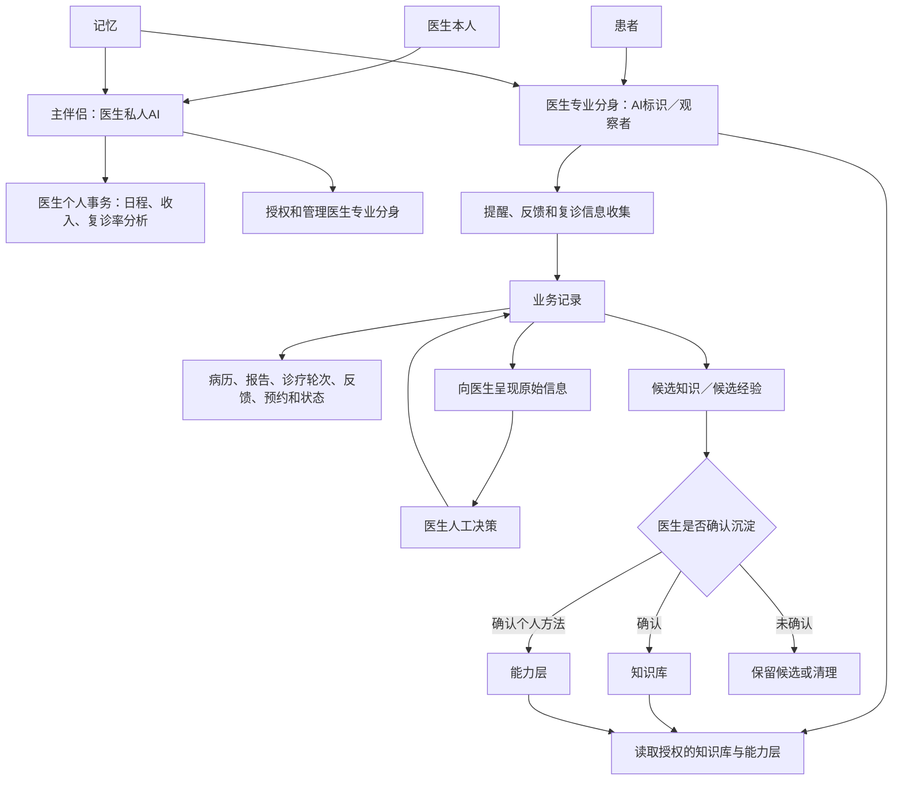
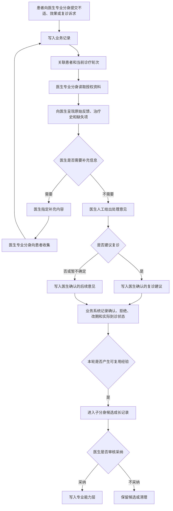

# 中医核心场景——记忆与三级知识库映射规范

## 文档信息

| 项目 | 内容 |
|---|---|
| 文档类型 | 顶层设计的场景化映射规范 |
| 文档状态 | 待产品确认稿 |
| 版本 | v0.10 |
| 更新时间 | 2026-07-23 |
| 顶层依据 | `数字伴侣记忆系统技术方案 v1.0` |
| 核心场景 | 长期调理患者服药反馈、信息收集与复诊状态回顾 |
| 关联文档 | [中医复诊前信息收集与状态回顾-用户场景](中医复诊前信息收集与状态回顾-用户场景.md)、[中医患者诊疗与复诊-完整流程](中医患者诊疗与复诊-完整流程.md) |

> [!IMPORTANT] 架构口径
> 主伴侣是医生本人的私人AI，不是诊所患者管理系统。医生专业分身是面向患者的专业服务接口。记忆、知识库、能力层和业务记录必须分开建模，不得互相替代。

## 1. 工作口径与证据等级

本文继续采用此前用户研究与产品拆解的工作方式，不将访谈陈述、架构规定和产品推断混为一谈。

| 类型 | 定义 | 本文使用方式 |
|---|---|---|
| 访谈事实 | 受访者实际陈述或观察到的行为 | 只代表对应样本，不直接推广到全部中医 |
| 顶层设计 | 已有产品技术方案中的正式定义 | 作为架构映射依据，但允许提出内部冲突和待确认项 |
| 已确认产品决策 | 当前讨论中已经明确的产品边界 | 直接进入本规范 |
| 产品推导 | 基于场景和架构作出的设计建议 | 标记为建议，不视为已经确认 |
| 待验证假设 | 尚缺真实用户或使用数据支持的判断 | 进入待确认或验证清单 |

> [!WARNING] 使用限制
> 本文不将AI生成内容视为用户访谈证据；不将单个受访者陈述推广为市场结论；不将顶层设计中的示例自动视为中医场景的真实业务规则。

## 2. 本次变更项

### 2.1 架构定义变更

| 编号 | 原有表述 | 本次变更 | 变更依据 | 当前状态 | 影响 |
|---|---|---|---|---|---|
| C-01 | 三级知识库为“公共—机构—医生个人” | 改为“公共—个性化—协作” | 顶层设计第四章对三级知识库的正式定义 | 采用顶层定义 | 需要重做中医资料归属 |
| C-02 | 医生个人经验属于第三级个人知识库 | 改归“专业能力层” | 顶层设计第六章主伴侣与子分身记忆架构 | 采用顶层定义 | 医生经验与患者业务记录不再混用 |
| C-03 | 患者原始资料直接作为个性化知识库内容 | 改为患者病历、诊疗轮次和状态首先进入业务记录；个性化知识库只保存经过治理的长期信息资产或授权索引 | 用户确认的四概念边界 | 已确认产品边界 | 需要修正顶层文档中“病人档案知识库”的表达 |
| C-04 | 医患共享资料未定义独立归属 | 当前治疗中的共享内容进入协作知识库 | 顶层设计中的医生—病人协作区示例 | 场景映射建议 | 需要定义共享字段和关闭后的归档方式 |
| C-05 | 机构知识库是固定第二级 | 不再作为独立固定层级 | 顶层设计没有“机构知识库”这一层 | 待产品确认 | 机构资料需按共享对象进入公共或协作知识库 |

### 2.2 角色与工作流变更

| 编号 | 原有表述 | 本次变更 | 变更依据 | 当前状态 | 影响 |
|---|---|---|---|---|---|
| C-06 | 存在医生助理／导诊角色 | 删除真人助理角色 | 用户明确说明“没有真人助理这个角色” | 已确认产品场景边界 | 事务由主伴侣、医生专业分身和系统承担 |
| C-07 | 多个AI助手分别承担问答、流程和调用 | 将其视为能力模式，不新增角色 | 当前产品架构为主伴侣与专业分身 | 产品架构推导 | 防止角色重复和职责冲突 |
| C-08 | 主 Agent直接承担所有信息处理 | 主伴侣只面向医生本人并管理专业分身授权；医生专业分身承担患者侧专业信息处理 | 用户确认的主伴侣／专业分身边界 | 已确认产品边界 | 需要定义两者各自可读取的数据范围 |
| C-09 | 子分身可以从患者反馈中直接学习 | 新经验先进入子分身候选成长记录，审核后才能进入专业能力层 | 顶层设计的自下而上流动规则要求主伴侣审核 | 采用并增加医疗人工确认 | 避免未经确认的医疗经验正式生效 |

### 2.3 信息和AI边界变更

| 编号 | 原有表述 | 本次变更 | 变更依据 | 当前状态 | 影响 |
|---|---|---|---|---|---|
| C-10 | AI摘要可作为复诊主要输入 | AI摘要暂不作为已确认实行手段 | 用户此前明确指出可能增加医生核对负担 | 已确认研究结论 | MVP优先呈现结构化原始信息 |
| C-11 | AI可自动更新患者档案 | AI只能生成结构化候选，医疗结论需医生确认 | 治疗方案与复诊建议必须由医生人工决策 | 已确认产品边界 | 数据模型必须保存确认状态 |
| C-12 | AI可自动判断风险和是否转医生 | 不纳入当前已确认流程 | 目前没有访谈依据和产品规则 | 待验证 | 首版只做信息传递，不作医疗分级 |
| C-13 | 患者记录可自动提炼为跨患者医疗洞察 | 暂缓自动沉淀和跨患者模式发现 | 顶层设计虽提出该能力，但当前缺少授权、脱敏和审核规则 | 风险项／待确认 | 不进入MVP |
| C-14 | 每轮诊疗后创建固定复诊任务 | 改为由患者反馈、患者主动申请或医生建议触发 | 用户访谈资料及此前流程修正 | 访谈事实加产品边界 | 复诊状态不能只用“是／否”表示 |
| C-15 | 主伴侣直接创建患者资料任务、提醒和预约 | 主伴侣退出患者管理执行层，只面向医生本人 | 用户确认主伴侣是医生本人的私人AI | 已确认产品边界 | 患者侧动作改由医生专业分身和业务系统承担 |
| C-16 | 医生专业分身只是主伴侣内部的信息工具 | 医生专业分身以观察者身份面向患者，协助医生对外服务 | 用户确认的产品定位 | 已确认产品边界 | 患者反馈、提醒和复诊信息收集由专业分身辅助承接，但不冒充医生 |
| C-17 | 记忆、知识库和患者档案可以混合表达 | 拆分为记忆、知识库、能力层和业务记录 | 用户提出的边界澄清原则 | 已确认产品边界 | 资料模型和调用规则需要按四类重构 |
| C-18 | 专业分身被设计成患者可感知的独立角色 | 专业分身对患者透明，对话主体保持为医生本人；C端仅按当前政策要求显示AI标识 | 用户确认的患者感知边界 | 已确认产品边界 | 不设计独立专业分身联系人或角色切换 |
| C-19 | 患者需要进入独立专业分身入口 | 患者继续使用医生联系人对话框，专业分身作为旁观者介入 | 用户对Q1的确认 | 已确认交互边界 | 不新增患者侧独立入口 |
| C-20 | 专业分身默认可进入所有医生对话 | 只有主用户已创建专业分身且联系人已标记为客户时才可介入 | 用户对Q2的确认 | 已确认权限前提 | 需要在运行时检查两个条件 |
| C-21 | 专业分身可直接回复患者 | 当前策略为AI 草稿回复，需医生查看或修改，并由医生主动点击发送 | 用户对Q6的确认 | 已确认 | AI标识具体样式仍待定义 |
| C-22 | 医生确认草稿后系统可以自动发送 | 必须由医生主动点击发送，系统不得自动发送 | 用户确认的AI 草稿发送规则 | 已确认产品边界 | 需要记录医生发送动作和最终内容 |
| C-23 | 最小信息通过固定完整问卷收集 | 专业分身优先复用已有业务记录，并在同一对话中按任务补齐最少缺失信息 | 用户确认的Q3产品原则 | 已确认产品边界 | 具体字段由P0医生按真实任务配置 |

## 3. 变更依据

### 3.1 顶层设计依据

来源：`数字伴侣记忆系统技术方案 v1.0`。

| 顶层设计内容 | 对本规范的约束 |
|---|---|
| 知识库是被主动构建和管理的记忆 | 需要区分有机记忆、知识库和原始业务记录的状态 |
| 三级知识库为公共、个性化、协作 | 中医场景必须沿用这一正式分级 |
| 主伴侣拥有核心记忆并协调子分身 | 主伴侣不等同于患者管理执行工具 |
| 专业能力由主伴侣选择性授权给子分身 | 医生专业分身不能默认读取全部个人能力 |
| 子分身的新经验需向上汇报并经审核采纳 | 子分身学习结果不能直接进入正式知识 |
| 采用ACL、最小权限、审计日志和即时回收 | 每次患者资料调用必须可追溯、可撤销 |

### 3.2 用户访谈与场景依据

以下仅作为当前已有访谈资料，不代表全部中医：

- 一位受访中医提出，患者治疗史是最难获取的信息；
- 患者服药后出现不适或后期没有效果时，可能主动询问或要求复诊；
- 有的医生会主动询问患者服药后的情况；
- 长期调理患者并不一定在每轮问诊结束后获得下一次复诊意见；
- 复诊后医生仍需再次问诊和把脉。

这些资料支持建设连续患者记录和反馈闭环，但尚不能证明：

- 该问题在目标中医群体中普遍高频；
- 患者愿意持续提前提交信息；
- AI摘要能够降低医生总工作量；
- 节省时间一定能够增加医生收入；
- 医生本人具有购买权。

### 3.3 已确认产品决策

- 当前场景不存在真人助理角色；
- 主伴侣是医生本人的私人AI，不是诊所患者管理系统；
- 主伴侣面向医生本人，关注医生的日程、收入、复诊率分析和个人事务；
- 医生专业分身以观察者身份面向患者，协助医生完成诊疗相关信息交互、提醒和复诊信息收集；
- 因当前政策要求，C端与专业分身对话时暂时显示AI标识；
- 专业分身不形成患者可感知的独立角色，患者感知为在医生本人联系人会话中沟通；
- C端不必展示AI 草稿与医生确认的内部流转，但系统必须保留相应状态和日志；
- 患者通过原有医生联系人对话框与医生及专业分身交互，不新增独立入口；
- 专业分身介入前必须满足“已创建专业分身＋联系人已标记为客户”；
- 当前患者回复策略为AI 草稿回复，医生查看、修改或确认后才能进入发送环节；
- 医生确认或修改AI 草稿后必须主动点击发送，系统不得自动发送；
- 最小信息采用已有业务记录优先、按任务补缺的对话式收集，不使用固定完整问卷；
- 治疗方案必须由医生人工决策；
- 复诊建议必须由医生人工决策；
- AI可以介入诊疗信息处理，但不作最终医疗决策；
- AI摘要暂不作为已经确认的实行手段；
- “重大情况医生优先处理”目前没有证据，不作为已确认规则；
- 诊疗具体手段暂不展开；
- “长期调理患者复诊前的信息收集与状态回顾”已经选定为最高频、最高价值核心场景；
- 首版围绕该核心场景建设最小闭环，不先建设大而全的知识库。

### 3.4 本文新增的产品推导

以下内容是基于顶层架构作出的建议，仍需产品确认：

- 当前治疗过程建立一个医患协作区；
- 医生专业分身按单次任务获得患者资料访问权；
- AI结构化结果采用“候选—待确认—已确认”的状态链；
- 协作知识库只保存当前协作所需信息，不复制完整患者档案；
- 子分身候选经验与正式专业能力分区保存。

### 3.5 边界澄清原则（新增第7条）

> [!IMPORTANT] 第7条：概念边界必须严格区分
> 记忆（Memory）、知识库（KB）、能力层（Capability）和业务记录（Record）各司其职，不得混用。

| 概念 | 定义 | 中医场景示例 | 不应承担 |
|---|---|---|---|
| 记忆 Memory | 会话上下文、近期事实和用户偏好，主要服务连续交互 | 医生近期关注的事务、表达偏好、当前会话上下文 | 保存正式病历或充当长期权威知识 |
| 知识库 KB | 经过整理、确认、可检索和长期管理的信息资产 | 权威中医资料、已确认流程、长期结构化信息资产 | 直接承载未经治理的原始业务数据 |
| 能力层 Capability | Agent执行专业任务所需的技能、医生经验、方法和表达 | 医生的信息收集方法、历史经验、沟通方式 | 保存单个患者的原始病历 |
| 业务记录 Record | 业务过程中产生的原始数据、事实、状态和正式记录 | 病历、检查报告、诊疗轮次、处方版本、反馈、预约、日程和笔记 | 自动被视为可复用知识或Agent能力 |

四者之间允许受控流转，但不允许直接等同：

```text
业务记录
→ 形成候选知识或候选经验
→ 脱敏、整理、确认
→ 进入知识库或能力层

知识库／能力层
→ 在授权范围内被专业分身调用
→ 产生新的业务记录

近期交互
→ 形成记忆
→ 过期、纠正或按规则沉淀
```

## 4. 架构目标

本规范用于回答四个问题：

1. 中医核心场景产生的资料写入哪里；
2. 哪些资料可以被患者、医生、主伴侣或医生专业分身读取；
3. 哪些内容必须经过医生确认；
4. 哪些内容可以从当前诊疗记录沉淀为专业能力。

本规范不讨论具体辨证方法和治疗手段。治疗方案、复诊建议及诊疗结论必须由医生人工决策。

## 5. 顶层架构映射



## 6. 资料归属矩阵

| 资料 | 主要存储位置 | 可共享位置 | 确认状态 | 主要读取者 |
|---|---|---|---|---|
| 患者姓名、出生日期、性别 | 患者业务记录 | 必要时开放到协作区 | 患者提交／待核对 | 患者、医生、授权专业分身 |
| 既往病史、过敏史 | 患者业务记录 | 当前诊疗必要部分 | 患者自述／医生确认 | 医生、授权专业分身 |
| 检查报告原件 | 患者业务记录 | 当前诊疗必要部分 | 原始资料 | 患者、医生 |
| 患者治疗史 | 跨轮次业务记录的聚合视图 | 当前诊疗必要部分 | 来源分别标记 | 医生、授权专业分身 |
| 本次诉求和主要症状 | 当前诊疗轮次业务记录 | 协作知识库／协作视图 | 患者自述 | 患者、医生、授权专业分身 |
| 服药执行情况 | 当前诊疗轮次业务记录 | 协作知识库／协作视图 | 患者自述 | 患者、医生 |
| 服药后不适、效果和新症状 | 当前诊疗轮次业务记录 | 协作知识库／协作视图 | 患者自述／医生待处理 | 患者、医生、授权专业分身 |
| 医生诊疗结论 | 正式诊疗业务记录 | 经医生授权后共享 | 医生确认 | 医生、患者 |
| 治疗方案及版本 | 正式诊疗业务记录 | 协作知识库／协作视图 | 医生确认 | 医生、患者 |
| 注意事项 | 正式诊疗业务记录 | 协作知识库／协作视图 | 医生确认 | 医生、患者、授权专业分身 |
| 复诊建议 | 正式诊疗业务记录 | 协作知识库／协作视图 | 医生确认 | 医生、患者 |
| 复诊确认、改期、未到诊状态 | 业务状态记录 | 协作视图 | 行为事实 | 患者、医生、授权专业分身 |
| 中医通用专业资料 | 公共知识库 | 按授权调用 | 来源及版本确认 | 医生专业分身、医生 |
| 医生信息收集规则 | 专业能力层 | 授权给医生专业分身 | 医生确认 | 主伴侣、医生专业分身 |
| 医生历史案例经验 | 专业能力层 | 原则上不直接向患者开放 | 脱敏且医生确认 | 医生、授权专业分身 |
| 子分身发现的新规律 | 子分身独立成长记录 | 不进入正式知识调用 | 候选 | 医生、主伴侣 |
| 用户访谈、ICP和市场洞察 | 产品研究库 | 产品团队内部 | 证据与结论分开 | 产品团队 |

## 7. 写入状态

医疗场景中的信息不能只区分“已入库”和“未入库”。统一使用以下状态：

```text
原始资料
→ 患者自述
→ AI结构化候选
→ 医生待确认
→ 医生已确认／已订正
→ 正式归档
→ 历史版本／失效
```

### 7.1 可直接记录的内容

- 患者提交的原始文字、图片和文件；
- 提交时间、发生时间和信息来源；
- 患者是否确认复诊；
- 改期、取消、到诊或未到诊等行为事实；
- 系统执行和权限操作日志。

直接记录不代表内容已经获得医生专业确认。

### 7.2 必须由医生确认的内容

- 诊疗结论；
- 治疗方案及其修改；
- 注意事项；
- 复诊建议；
- 对患者反馈的专业解释；
- 从患者案例中提炼的医生经验；
- 允许医生专业分身长期使用的专业规则。

### 7.3 暂不允许自动写入正式内容

- AI生成的诊疗摘要；
- AI判断的病症或异常等级；
- AI推断的不适原因；
- AI生成的治疗或复诊建议；
- 跨患者自动发现的医疗规律；
- 子分身未经医生审核的新经验。

## 8. 读取与调用规则

| 调用主体 | 默认可读取 | 默认不可读取或写入 |
|---|---|---|
| 主伴侣 | 医生本人的日程、偏好、收入及复诊率等授权汇总信息；专业分身授权状态 | 直接面向患者执行提醒、资料收集或预约；默认读取完整患者病历 |
| 医生专业分身 | 当前任务所需患者资料、公共知识、被授权的专业能力 | 修改主伴侣核心记忆；直接形成医疗决策；以医生本人身份发言 |
| 医生 | 授权患者的完整诊疗资料、相关专业能力和公共知识 | 其他医生未授权的私人专业资产 |
| 患者 | 本人提交资料、医生允许共享的方案和注意事项、协作状态 | 医生内部判断、候选经验、其他患者资料 |
| 产品团队 | 脱敏后的产品使用数据和研究资料 | 无明确授权的患者诊疗内容 |

读取必须同时满足：

1. 当前任务确有需要；
2. 调用主体具备权限；
3. 信息仍在有效期内；
4. 来源和确认状态可见；
5. 调用范围符合最小必要原则。

## 9. 核心场景的信息流



## 10. MVP范围

首版只需实现：

- 每位患者独立的业务记录；
- 一次治疗过程对应的医患协作视图；
- 患者原始反馈与当前诊疗轮次关联；
- 治疗史和历次反馈的按时间查看；
- 患者自述与医生确认状态分离；
- 治疗方案和复诊建议的人工确认；
- 主伴侣对医生专业分身的管理和最小权限授权；
- 主伴侣的医生个人事务视图与患者业务执行隔离；
- 操作、确认和版本日志。

首版暂不实现：

- AI摘要替代原始信息；
- 自动医疗风险判断；
- 自动形成复诊建议；
- 自动将患者记录沉淀为专业经验；
- 跨患者模式发现；
- 多个子分身之间的知识自动流转；
- 完整的记忆衰减和自动清理。

## 11. 待确认问题

### 11.1 顶层设计内部需要确认

| 编号 | 待确认问题 | 问题来源 | 不确认的影响 | 推荐方向 |
|---|---|---|---|---|
| Q-01 | 个性化知识库“不可删除”与用户可删除记忆如何同时成立？ | 顶层文档内部存在冲突 | 无法定义正式诊疗记录和普通记忆的删除策略 | 区分普通记忆、AI提炼内容和正式诊疗记录 |
| Q-02 | 会话结束清理原始全文是否适用于医疗相关对话？ | 顶层文档的自动遗忘规则 | 可能丢失患者原始陈述和操作依据 | 医疗原始信息进入保留例外 |
| Q-03 | “记忆层私有、不上云”是否是全部数据的部署要求？ | 顶层架构总结 | 影响存储、同步、多端和机构协作方案 | 明确数据类型与部署范围 |
| Q-04 | 顶层设计中的L1—L4知识级别与三级知识库是什么关系？ | 文档同时存在两套分级 | 容易将共享边界和知识稳定性混用 | 定义为两个正交维度 |

### 11.2 资料归属需要确认

| 编号 | 待确认问题 | 当前建议 | 需要谁确认 |
|---|---|---|---|
| Q-05 | 机构制度和机构专业资料进入公共还是协作知识库？ | 按适用范围区分，不另设机构层 | 顶层产品负责人 |
| Q-06 | 医生内部诊疗判断如何保存？ | 保存于患者业务记录中，但默认不向患者共享 | 医疗产品负责人 |
| Q-07 | 同一份治疗方案是否同时写入个性化和协作知识库？ | 个性化库保存主记录，协作库保存授权引用 | 产品与技术负责人 |
| Q-08 | 协作结束后，协作内容冻结、归档还是并入个性化知识库？ | 冻结快照并保留对主记录的引用 | 产品负责人 |
| Q-09 | 医生案例经验属于医生、机构还是共同资产？ | 每条内容单独记录权利和授权范围 | 业务及合规负责人 |

### 11.3 权限与Agent边界需要确认

| 编号 | 待确认问题 | 当前建议 | 影响 |
|---|---|---|---|
| Q-10 | 主伴侣为医生提供复诊率等分析时，可以读取到什么粒度？ | 默认只读取授权汇总和索引，不直接读取完整患者病历 | 决定隐私暴露面 |
| Q-11 | 医生专业分身调用患者资料由谁授权？ | 患者数据授权加医生任务授权 | 决定授权流程 |
| Q-12 | 患者可以查看协作区中的哪些字段？ | 只查看明确标记为患者可见的内容 | 决定字段级ACL |
| Q-13 | 子分身候选经验保存多久？ | 设有效期，超期未审核则归档或清理 | 决定候选区噪音规模 |
| Q-14 | “可读取”是否默认包含“可用于模型训练”？ | 必须分开授权，默认不包含 | 决定数据使用边界 |
| Q-15 | 患者改期、未确认后实际复诊是否需要医生人工处理？ | 系统先记录行为事实；只有涉及医学判断时转医生 | 决定流程自动化边界 |
| Q-16 | C端AI标识具体显示在哪里、持续显示还是仅首次提示？ | 对话页持续可见，并在首次交互说明身份与边界 | 决定身份披露体验 |
| Q-17 | C端AI标识如何显示，同时保持医生联系人为对话主体？ | 对话主体保持医生，AI标识仅说明存在AI辅助 | 决定政策提示与用户感知 |
| Q-18 | 患者如何请求医生本人介入？ | 无需独立请求入口；患者在医生联系人对话中发消息即向医生沟通 | 已确认 |

### 11.4 P0核心用户的用户价值需要继续验证

#### P0核心用户范围

当前优先验证：

- 私立诊所、个人工作室或小型中医馆中的独立执业医生／经营者兼医生；
- 已有稳定患者，实际工作量接近其个人承载上限；
- 复诊、连续开方或长期调理患者占比较高；
- 已存在微信等远程、异步的诊后反馈；
- 患者资料分散在病历、微信、照片、报告或个人记忆中；
- 能够决定是否试用，且购买决策链较短。

该范围是当前P0用户假设。不同医生的接诊结构、复诊习惯、资料工具、收入方式和患者配合度不同，不能用单一答案代表全部P0用户。

#### 按医生逐人验证

| 编号 | 待验证问题 | 必须记录的个体差异 | 所需证据 |
|---|---|---|---|
| V-P0-01 | 该医生是否会在目标复诊开始前查看患者资料？ | 每周复诊量、查看发生在候诊前还是问诊中、查看渠道 | 最近5至10次真实复诊观察 |
| V-P0-02 | 该医生最需要恢复哪些病程上下文？ | 病种、长期调理方式、每轮间隔、个人问诊习惯 | 近期病例回溯及实际追问 |
| V-P0-03 | 该医生当前寻找和整理资料的成本是多少？ | 使用微信、纸质病历、系统或个人记忆；资料源数量 | 单例步骤、时间及失败点 |
| V-P0-04 | 治疗史缺失对该医生造成什么影响？ | 只增加询问时间，还是会改变追问、安排或判断 | 最近一次真实缺失案例 |
| V-P0-05 | 该医生的患者是否愿意提交反馈？ | 患者年龄、数字能力、医患关系、填写入口和反馈动机 | 该医生患者的提交率和放弃点 |
| V-P0-06 | 结构化原始信息是否优于该医生的现有方式？ | 当前方案成熟度、个人记录习惯、是否跨渠道 | 同一医生使用前后对比 |
| V-P0-07 | 新流程是否降低该医生的净任务成本？ | 查看时间、重复询问、核对和纠错成本 | 总处理时间和操作步骤 |
| V-P0-08 | 价值最终表现为什么？ | 减少认知负担、减少私人时间、提升承载量或改善连续性 | 医生实际行为及结果变化 |
| V-P0-09 | 该医生是否持续使用？ | 患者量、复诊比例、流程适配和替代方案 | 是否主动邀请下一批患者 |
| V-P0-10 | 该医生是否愿意付款？ | 收入方式、购买权、价值结果和切换成本 | 真实试用后的付费行为 |

#### 判断原则

- 不以所有P0医生的平均值替代个体差异；
- 不因为一名医生不提前查看资料，就否定其他P0医生的价值；
- 不因为一名医生觉得节省时间，就推断其收入会增加；
- 先识别价值成立的条件，再收敛更具体的P0子群；
- 访谈答案优先绑定最近一次真实复诊，不只记录态度。

## 12. 当前决策

> [!success] 保留
> 三级知识库名称继续使用顶层设计定义：公共知识库、个性化知识库、协作知识库；但“个性化知识库”的内容边界需要按四概念原则重新定义，不能直接等同于患者原始档案。

> [!WARNING] 修正
> “公共—机构—医生个人”不再作为三级知识库定义。机构资料根据服务对象进入公共或协作知识空间；医生知识和经验进入专业能力层；患者病历、日程和笔记首先进入业务记录。

> [!todo] 下一步
> 用3至5条真实患者资料进行归属演练，验证原始内容如何写入业务记录、哪些内容可形成协作视图、哪些内容经过确认后才能进入知识库或能力层。
